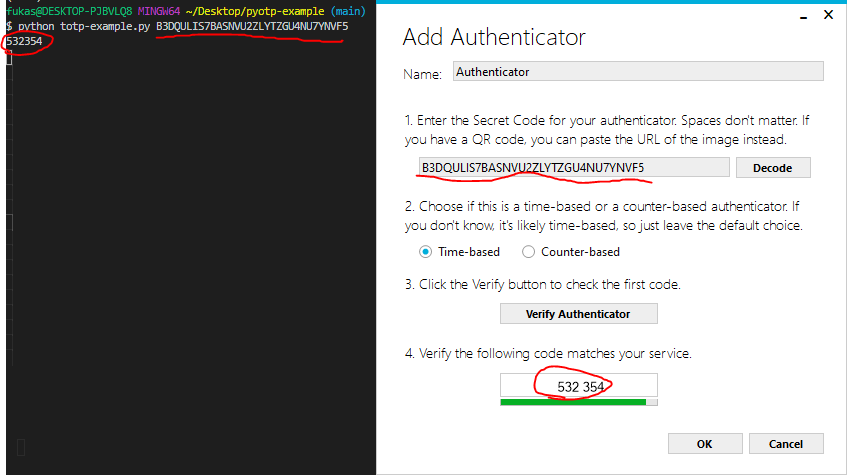

ワンタイムパスワード（OTP）のTOTPについて調べた。

ワンタイムパスワードは２段階認証をやったりするときに使う。何気なく使ってたけど、これどうやって実装するんだろう？と思っていたので感覚をつかみたかった。

TOTP(Time-Based One-Time Password)
---------------

### 概要

TOTPはTime-Based One-Time Password の略でOTPの実装の一つ。RFC 6238で決まってる。

https://tools.ietf.org/html/rfc6238

秘密鍵を事前に共有して、秘密鍵と時間に基づいたコードを生成し、それをワンタイムパスワードとして使う。

### 何をすればよいか

ユーザ側はコードを生成するためのアプリを用意する必要がある。Google AuthenticatorやMicrosoft Authenticatorとか。

サービス側は秘密鍵の保持と検証するためにコードを生成と比較をする必要がある。

### コードの生成の仕方

まず、秘密鍵を決める必要があるが、BASE32に基づいた値であればなんでもよい。BASE32は人が読みやすい値を採用した符号化方式。
なので、乱数で適当にバイナリ列を生成してBASE32に変換した値をユーザ毎に生成すればよい。（もちろん他の人が推測できないような乱数を使うようにしましょう。）


コードの生成は参照実装がRFCに書かれているが、たいていはライブラリがあるのでそれを利用すると簡単。
「TOTP 言語」で調べればそれっぽいライブラリが出てくる。
やることは秘密鍵と時間を基にコードを生成するだけなので、参照実装を読み解けば実装はできるはず（今回はやらない...）


### アプリと連携したい

RFCに従いアプリを作ればいいだけではありますが、アプリを作るのは大変なので、既存のものに乗っかるほうがよいでしょう。
有名なところでは、スマートフォンアプリにGoogle AuthenticatorやMicrosoft Authenticatorとかがある。WindowsであればWinAuthでも動作する。

最低限、秘密鍵の入力が出来れば連携は可能。


### アプリで読み取れるQRコードを生成したい

QRコード自体は「データ」をコンピュータで読み取れる画像で表現するだけのものなので、ここでは深くは触れない（QRコード内にロゴを入れたいとか色々あると思う。）

で、どういった「データ」を埋め込むかは、「URI形式でotpauth スキームに従った値」となる。

ただ、otpauthスキームは標準化されていないようで、アプリの動作による模様。残念。

Google AuthenticatorやMicrosoft Authenticatorについて調べた。

Google Authenticator は以下でまとまっている。
https://github.com/google/google-authenticator/wiki/Key-Uri-Format

Microsoft Authenticatorはotpauthスキームはサポートしているが、明確な資料がなさそう。

Google AuthenticatorとMicrosoft Authenticatorのクエリパラメータの挙動の違いを見てみたが、secret以外のクエリパラメータは無視する模様。

|           | Google | Microsoft |
| --------- | ------ | --------- |
| secret    | 〇     | 〇        |
| digits    | 〇     | ×(6)      |
| algorithm | 〇     | ×(SHA1)   |
| period    | 〇     | ×(30)     |
| issuer    | 〇     | ×         |

カッコ内の数値はGoogleを基準にしたときに相当する値で、同じURIで両方のアプリをサポートしたいといった最大公約数的な考え方で行くと、SHA1で、6桁で、30秒としないといけない。

また、ISSUERについても、Googleはクエリパラメータのissuerを表示するが、MicrosoftはラベルのほうのISSUERを表示する。

というわけで、以下のような形になればよい。

`"otpauth://totp/ISSUER:USER?secret=SECRET&issuer=ISSUER` 

（Googleのほうは、クエリパラメータのissuerとラベルのISSUERが一致するとラベルのほうのISSUERが省略されるが、一致しないとラベルのほうのISSUERが省略されないといった感じになる。まぁissuerの値は一緒にしておきましょうということ。）


Pythonによる実装
------------------

コードはいかにまとめました。

https://github.com/fukasawah/python-totp-example

### 秘密鍵の生成

やり方はなんでもいいです。ちなみに長さが5の倍数(byte)だとpaddingの削除が不要になります。

``` py:generate-key.py
import base64
import random

LEN=20
data = bytes([random.getrandbits(8) for _ in range(LEN)])

data_base32_str = base64.b32encode(data).decode().replace("=", "")
print(data_base32_str)
```

こんな感じに使い、BASE32の秘密鍵を生成します

``` bash
python generate-key.py
# => B3DQULIS7BASNVU2ZLYTZGU4NU7YNVF5
```

### QRコード生成

QRコード生成には`qrcode`を用います。

https://pypi.org/project/qrcode/

``` py:qrcode-generate.py
import sys
import qrcode
from urllib.parse import quote


# 手元で試すだけなので、引数で決める
if len(sys.argv) < 2:
    print("required argument")
    sys.exit(1)
  
SECRET_KEY_BASE32 = sys.argv[1]

USER = "example@dummy.local"
ISSUER = "EXAMPLE"

uri = f"otpauth://totp/{quote(ISSUER)}:{quote(USER)}?secret={SECRET_KEY_BASE32}&issuer={quote(ISSUER)}"

# 後述するpyotpを使う場合は以下のようにしても同様のURIが得られる
# import pyotp
# totp = pyotp.TOTP(SECRET_KEY_BASE32)
# uri = totp.provisioning_uri(name=USER, issuer_name=ISSUER)

# 画像を生成(PILImageオブジェクトが得られる)
image = qrcode.make(uri)

# 画像を保存
image.save("qrcode.png")
```

こんな感じに使うと、"qrcode.png"が生成されます。

``` bash
python qrcode-generate.py B3DQULIS7BASNVU2ZLYTZGU4NU7YNVF5
```

出来上がったQRコードをアプリで取り込んでみましょう。

### 検証するコード

pyotpを使います。

https://pypi.org/project/pyotp/


``` python:totp-example.py
import sys

import pyotp

# 手元で試すだけなので、引数で決める
if len(sys.argv) < 2:
    print("required argument")
    sys.exit(1)

SECRET_KEY_BASE32 = sys.argv[1]

# インスタンス生成
totp = pyotp.TOTP(SECRET_KEY_BASE32)

# 定期的にコードが更新されることを確認する
import time
prev_code = ""
while True:
    code = totp.now()  # ワンタイムパスワードを得る
    if prev_code == code:
        time.sleep(1)
        continue
    print(code)
    prev_code = code
```

こんな感じに使うと、コンソールにもワンタイムパスワードが表示されます。

``` bash
python totp-example.py B3DQULIS7BASNVU2ZLYTZGU4NU7YNVF5
```

アプリ側の表示と、検証コードで表示されるコードが一致するはずです。

なので、実際は以下のようになります。

- ユーザ: アプリに表示されたコードを入力してサービス側に送信する
- サービス: `totp.now()`で得られたコードと、ユーザが送信したコードが一致するかを検証する


その他
----------

### Winauth: Windows上で動作するTOTP対応アプリ

スマートフォンでしか動作確認していなかったが、Windows上で確認するためのアプリが無いか探したら「Winauth」があった。

https://github.com/winauth/winauth

「Support for time-based RFC 6238 authenticators (e.g. Google Authenticator) and HOTP counter-based authenticators」とあるので対応している

exeをダウンロードして起動したら以下の手順で追加する。

- Add→「Authenticator」を選択
- 秘密鍵を入力する箇所があるので、秘密鍵を入力
- Time-basedを選択する
- 「Verify Authenticator」 をクリックして表示されるコードを確認



おわり
---------

実際に動くWebアプリを作ったり、TOTP用の秘密鍵はどう扱えばよいのか、他の方式(HOTP)の優劣とか使い分けとか、どんなときにワンタイムパスワードを要求するのかとかもう少し調べるところはありそう。

ワンタイムパスワードも面倒なのでデバイス認証にしたい場合とかも気になる。FIDO U2Fとか。