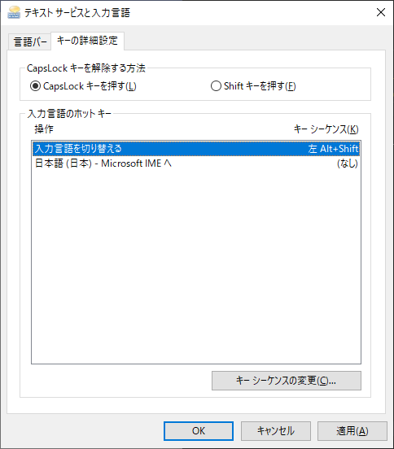

いちいち面倒なのでまとめておく。思い出したら書く。

### 日本語入力できなくなる

条件が良くわからないが急にテキストエリアに日本語入力できなくなる時があった（IMEが死んでいるかんじ？）

対処: タスクマネージャを表示し、"ctfmon.exe" をプロセス終了する。その後、勝手に"ctfmon.exe"が起動され、治るはず。

CTFMON.exeはどうやらこのサービスが起因しているらしいが、サービスを止めてしまうと日本語入力ができなくなる。

また、IME自体のバージョンアップによる弊害とも言われているので、それを前のバージョンに戻すことでも対処できるとのことらしい。手順は以下。

- Windowsキーを押し「IME」と入力
- 「日本語IME設定」が候補に出てくるので選択
- 「Microsoft IME」という見出しがついたウィンドウが開くので「全般」を選択
- 「以前のバージョンのMicrosoft IMEを使う」のトグルスイッチをオンにする

### 左Shift + Alt で入力言語が切り替わるのを無効にする

うっかり押すと英語配列キーボード扱いになったりして面倒。

対処: 

Windowsキーを押し「キーボードの詳細設定」と入力

キーボードの詳細設定を開き、「入力言語のホットキー」をクリック。

「入力言語を切り替える」操作を選択し、「キーシーケンスの変更」をクリック

割り当てなしにしてOKし、適用。

