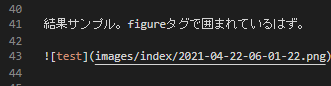

HugoはMarkdownをHTMLに変換してくれるが、このときのHookを提供してくれている

https://gohugo.io/getting-started/configuration-markup#markdown-render-hooks

例えばmarkdownでは画像を埋め込むことができるが、画像のサムネイルも作りつつそれに合ったHTMLを出したい、`loading="lazy"`をつけたい、といった場合、`layouts\_default\_markup\render-image.html`を用意することでできるようになる。


``` go
{{ .Destination | safeURL }}
{{- $res := .Page.Resources.GetMatch .Destination }}
{{- if $res }}
    {{- $image := $res.Fit "300x300 jpg q50" }}
    {{- $imageUrl := $image.RelPermalink }}
    <figure>
    <a href="{{ .Destination | safeURL }}" target="_blank">
        
    </a>
    {{- with .Text }}
        <figcaption>{{ . }}</figcaption>
    {{- end }}
    </figure>
{{- else }}
    
{{- end}}
```

（直リンク画像などはelseに該当するはずだが、あまり動作確認してない）

結果サンプル。markdown viewerでもみれていて、HTMLではfigureタグで囲まれているはず。



hugoのshortcodeと同じ要領なので全く同じことはshortcodeでもできるのだが、shortcodeはmarkdown viewerと相性が悪いのでこういうカスタマイズができるのはうれしい。