Azure AD B2CでめんどくさいID管理を丸投げできないかなと思い調べた

参考資料
---------

ドキュメント

- https://docs.microsoft.com/ja-jp/azure/active-directory-b2c/

読んでおくと良さそうな記事

- https://jpazureid.github.io/blog/azure-active-directory/azure-ad-b2c-fundamentals/
- https://qiita.com/Shinya-Yamaguchi/items/03321728b373a27be009


作成準備
-------------

### DNSゾーン作成（任意）

Azure DNSゾーンでやる必要はなく、任意のドメインレジストラで大抵対応できる。今回はなんとなくAzure DNSゾーンを作り委任する。

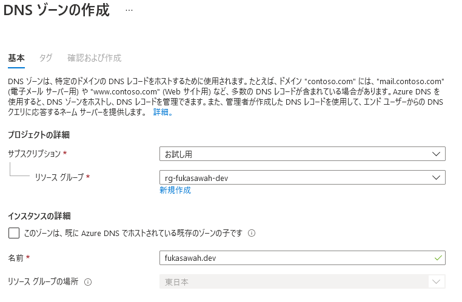

DNSゾーンに割り振られたネームサーバを確認

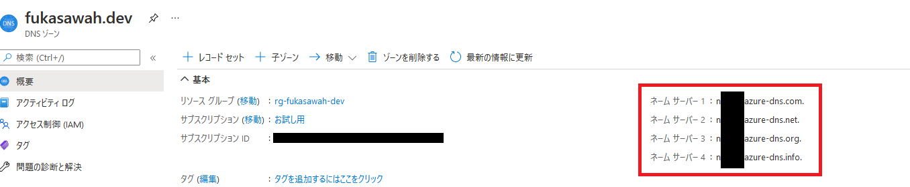

Googleドメインを使っていたので、Azure DNSゾーンのネームサーバを設定し、そちらを見てもらうようにする。

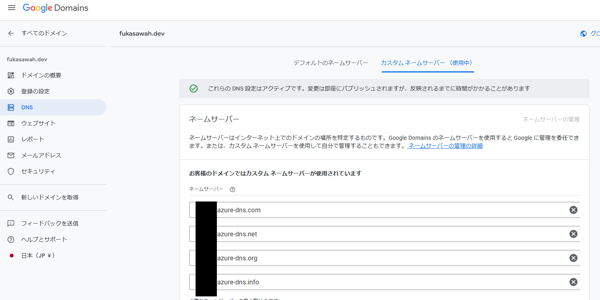


### サブスクリプションにリソースプロバイダを登録する

よくわかってないが予めやっておく必要がある。

サブスクリプション→リソースプロバイダから`Microsoft.AzureActiveDirectory`がRegisteredになっていることを確認する。

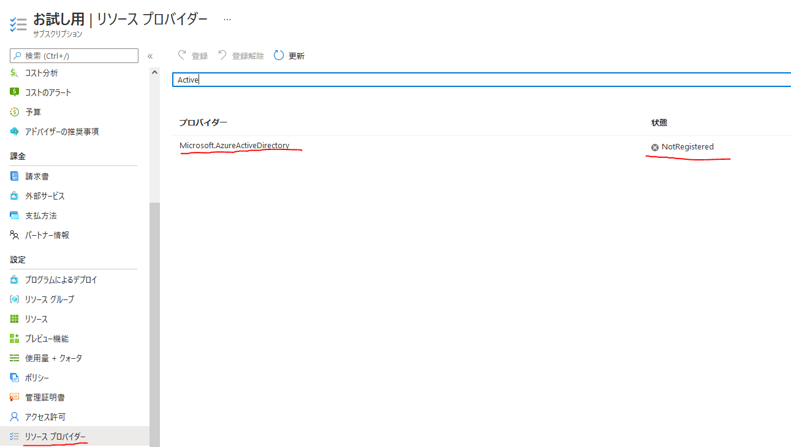

NotRegisteredな状態だと作れないので、その時は選択し登録する。


Azure AD B2Cテナントを作成
--------------------------

Azure AD B2C自体は「サービス」であり、実体は「テナント」と呼ぶ。（オブジェクト指向言語のクラスとインスタンスみたいな感じ。）


### Azure AD B2Cのテナントを作る

チュートリアルに従って進めた。

https://docs.microsoft.com/ja-jp/azure/active-directory-b2c/tutorial-create-tenant


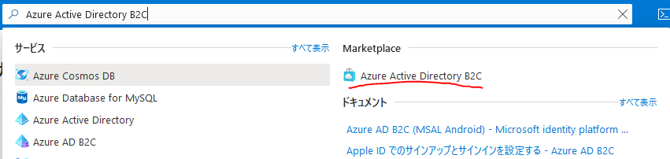

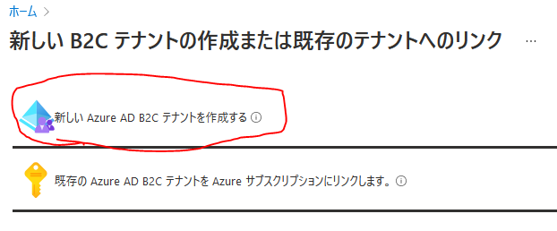

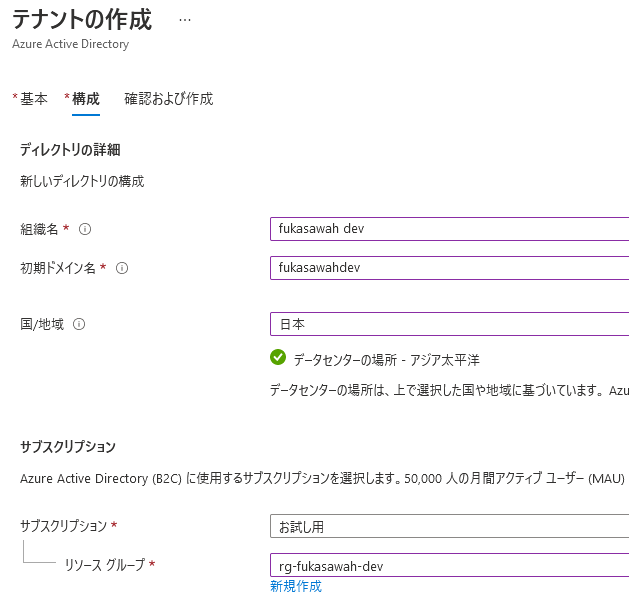


### カスタムドメイン追加

アプリを動かすだけなら無くてもいいのだが、せっかくなのでAzure AD B2Cをカスタムドメインで運用したい。

https://docs.microsoft.com/ja-jp/azure/active-directory-b2c/custom-domain

`Azure Active Directory` を開く。B2Cのほうではない。

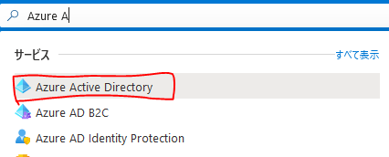

B2Cのものが表示されるはずなので確認する。そうでない場合は、ディレクトリの切り替えを行う。

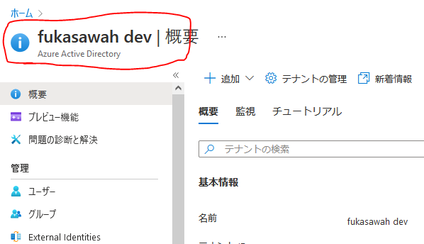

カスタムドメインを追加する。
apexドメイン(fukasawah.dev)でも良いが、今回はアプリケーションをいくつも持つ想定でサブドメイン `example.fukasawah.dev` としてみる。(テナント名も変えればよかった)

追加すると、ドメインの持ち主か確認のためレコードを登録する作業が必要。

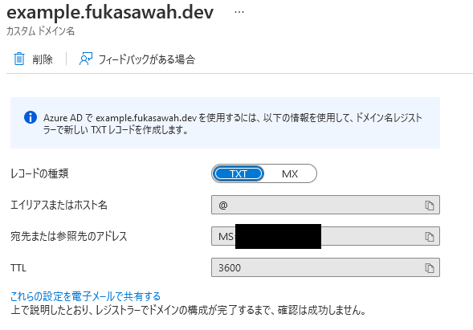

先ほど作ったDNSゾーンにレコードを登録する。apexドメインの場合は`@`でよいが、今回はサブドメイン`example.fukasawah.dev`を使っているので、`example`とする。

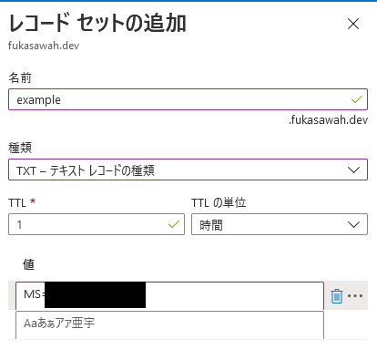

DNSゾーン登録後、確認し、DNSがうまく反映されていれば以下のような画面になる。

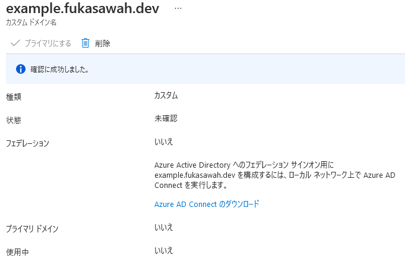

検証後はDNSゾーンのレコードを削除する（もう使わないので）

カスタムドメインを再度開き、プライマリに変更するのを忘れずに。

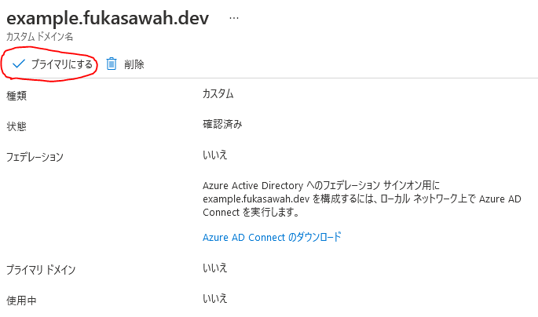


Azure AD B2Cで認証させるサンプルアプリを動かす
---------------------

https://docs.microsoft.com/ja-jp/azure/active-directory-b2c/configure-authentication-sample-web-app?tabs=visual-studio-code

ここにサンプルコードがあるので、予めcloneしておく。
それを自分が作ったAzure AD B2Cに連携させてみる。

### ユーザフローを作成する

ユーザフローは要所（サインイン・サインアップ・パスワードリセット・プロフィール編集）において、認証の仕方や、どの情報を登録できるか、どの情報を返すかをコントロールできる。（こんなに分けて作る意味あるのか？という気もするが）

https://docs.microsoft.com/ja-jp/azure/active-directory-b2c/add-sign-up-and-sign-in-policy

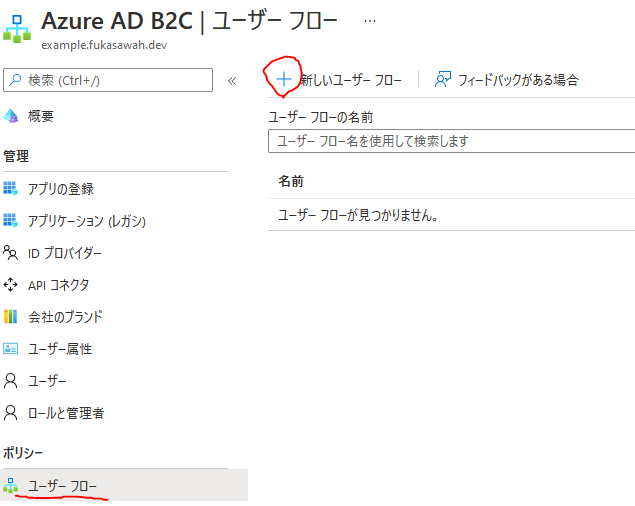

ユーザーフロータイプを選択する。今回はユーザが自分からサインアップ（登録）もできるようにしたいので「サインアップとサインイン」を選ぶ。
サインインのみなら「サインイン」を選ぶ。

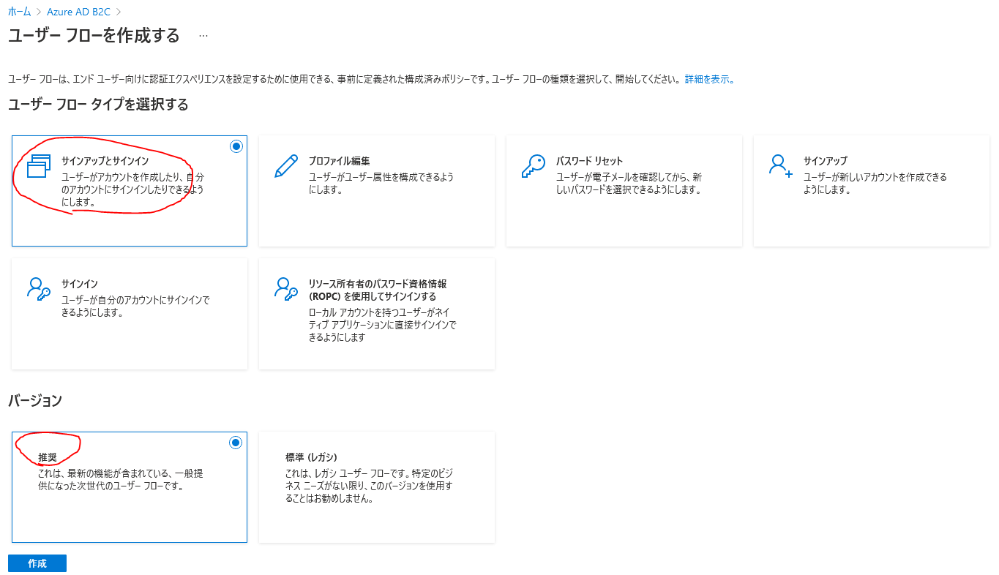

フロー名をつけ適当に項目を埋める。

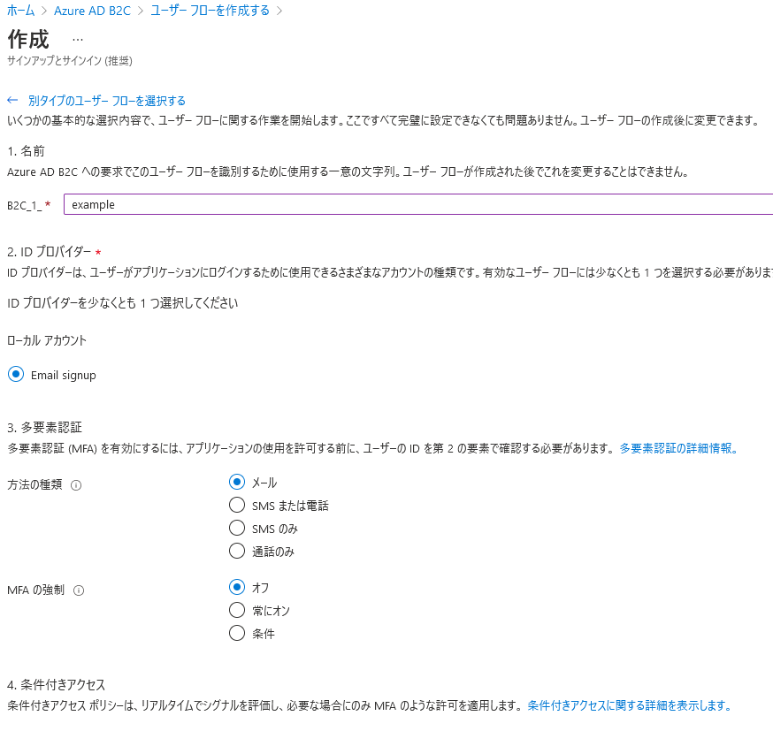

「 ユーザー属性とトークン要求」は、「属性を収集する」がサインアップ時に入力させる項目「要求を返す」がサインイン後にトークンに含めるclaimの情報になる。

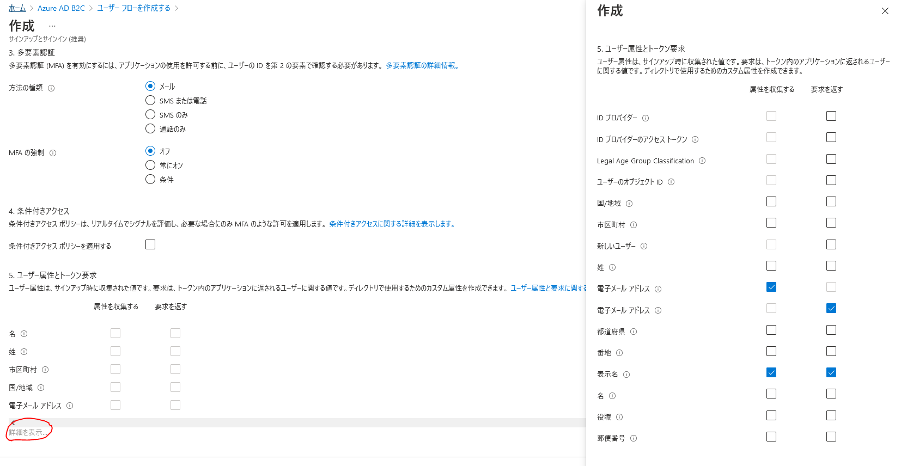

後は必要に応じて作ればよいが、最低限サインインとパスワードリセットの2つは作っておいた方がよさそう。

### アプリの登録を行う

テナントを開き、アプリの登録を行う。

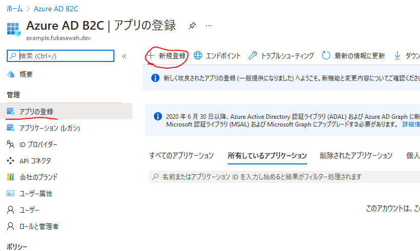

「任意の ID プロバイダーまたは組織ディレクトリ内のアカウント (ユーザー フローを使用したユーザーの認証用)」にすること。
このテナントしか使わないからと「この組織ディレクトリのみに含まれるアカウント」を選ぶと、通らなくなるので注意。

リダイレクトURIは動作確認用アプリに合わせた値を指定する。（サンプルアプリの都合から`https://localhost:44316/signin-oidc`とした）

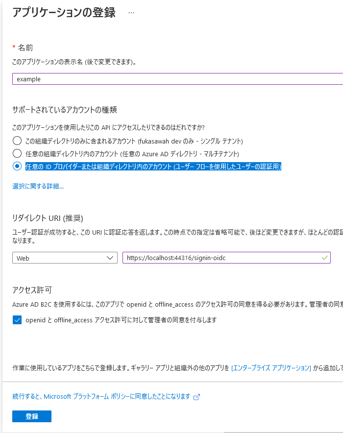


認証でIDトークンにチェックする。アクセストークンは渡す必要ないはず。

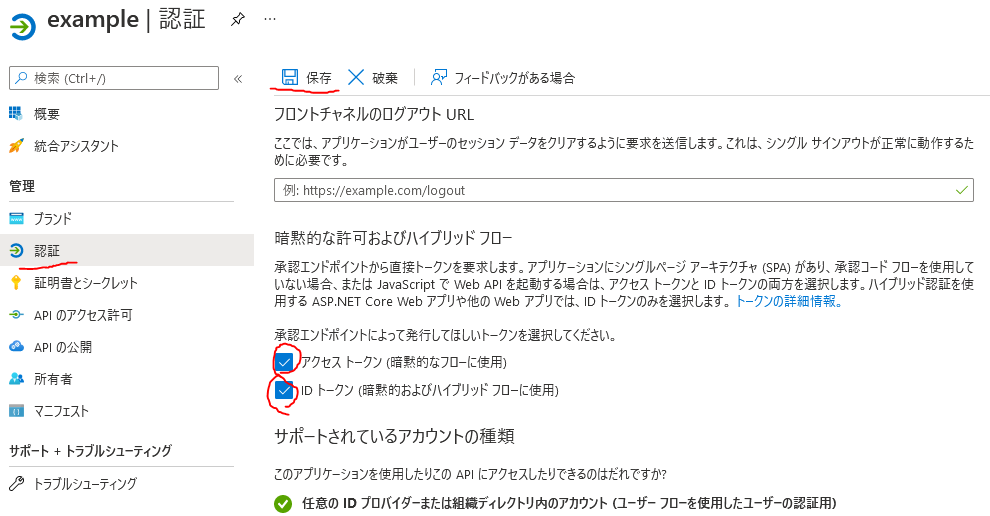

クライアントIDは設定に使うのでコピーしておく

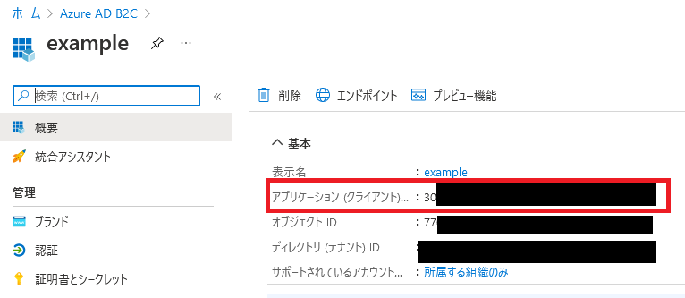

### サンプルアプリの設定に反映

appsettings.jsonの内容を書き換える。

``` json
    "AzureAdB2C": {
        "Instance": "https://fukasawahdev.b2clogin.com", // `初期ドメイン名.b2clogin.com`
        "ClientId": "*********************", // アプリの登録で登録したクライアントID(アプリケーションID)
        "Domain": "example.fukasawah.dev", // Azure AD B2C テナントのドメイン名
        "SignedOutCallbackPath": "/signout/B2C_1_example", // /signout/サインインのユーザーフロー名
        "SignUpSignInPolicyId": "B2C_1_example" // /signoutサインインの/ユーザーフロー名
        //"ResetPasswordPolicyId": "b2c_1_reset_password" // パスワードリセットのユーザーフロー名
        //"EditProfilePolicyId": "b2c_1_edit_profile" // プロフィール編集のユーザーフロー名
        //"CallbackPath": "/signin/B2C_1_sign_up_in"  // defaults to /signin-oidc
    },
```

Instanceの値は、Azure AD B2Cを作成した時の「初期ドメイン名」に使った内容がベースになる模様。
`初期ドメイン名.onmicrosoft.com`だった場合、`初期ドメイン名.b2clogin.com`になる。

### サンプルアプリを動かす

```
dotnet run
```

プロジェクト内の設定ファイルのおかげで起動後にブラウザが開くはず。

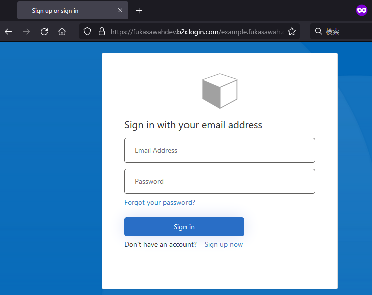

ログイン画面はURLが`fukasawahdev.b2clogin.com` という形になる。
独自ドメインで見せたい場合は、Azure FrontDoorを入れる必要がある模様。証明書の兼ね合いもあるのでなんらかのリバースプロキシを置くしかない・・・

https://docs.microsoft.com/en-us/azure/active-directory-b2c/custom-domain?pivots=b2c-user-flow

「sign up now」からユーザ登録ができる。もしユーザ登録させたくない場合は「ユーザフローポリシー」を「サインイン」で作り、それをアプリの設定に使う。

メール認証する必要があり、メール認証を終えると登録できる。

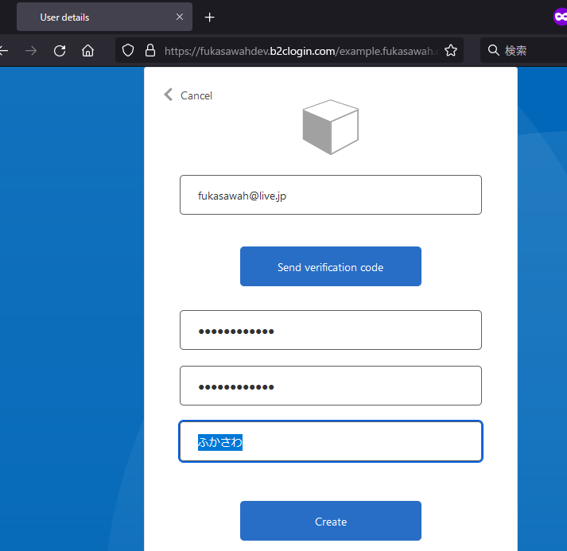

登録後、リダイレクトして戻ってくる。ユーザ情報を取れていることが分かる。

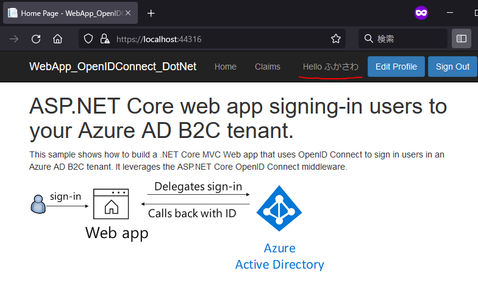

サンプルアプリではClaimの内容も確認できる（cookieは暗号化されているっぽい？）

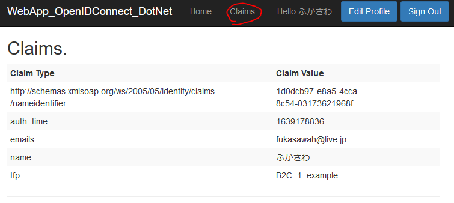

ユーザー登録したので、AD上にもユーザが増えている

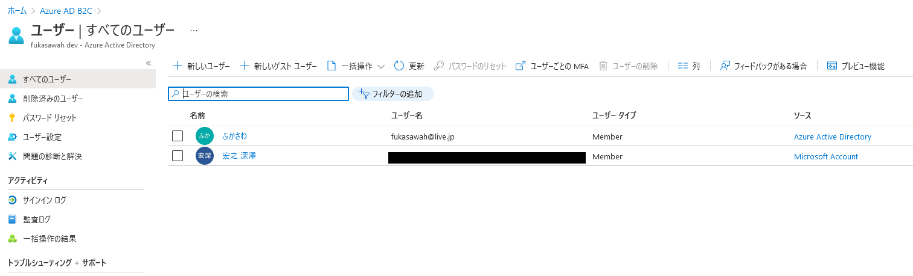


### トラブルシューティング

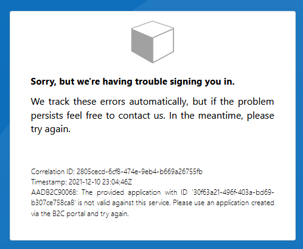

```
AADB2C90068: The provided application with ID 'クライアントID' is not valid against this service. Please use an application created via the B2C portal and try again.
```

次を見て解決。

https://docs.microsoft.com/en-us/answers/questions/360401/aadb2c90068-the-provided-application-with-id-is-no.html

「アプリを登録」するときに「**任意の ID プロバイダーまたは組織ディレクトリ内のアカウント**」を選ぶ必要があった。
外部のIDプロバイダ使わないし「この組織ディレクトリのみに含まれるアカウント」でよいのでは？と思って選ぶとこれにハマる。


終わり
-----------

これだけなのに4時間ぐらいかかった。

しかもやっただけで、細かいところはよくわかってない。やることはまだまだありそうだが一旦ここまで。

- ユーザ登録を柔軟に制御したい場合（管理画面などから登録させるとか、招待メールを送るとか、一括登録とか）
- アプリ上のデータの紐づけ方（クレームに含まれるユーザのObjectIDでやっていいのかどうかとか）
- ブランディングの強化
  - ログイン画面の見た目変更（分かる人はMicrosoftのやつじゃんってすぐわかっちゃう）
    - 単純なレベルならブランドの設定で出来そう
    - より細かくもできるかもしれない？
      - https://docs.microsoft.com/ja-jp/azure/active-directory-b2c/customize-ui-with-html?pivots=b2c-user-flow
  - 日本語化（ブラウザの言語設定をみているかもしれない。が、私の環境は日本語のはずだが英語で出る）
  - Azure Frontdoorを使って、カスタムドメインでログイン画面を見せたい。`.b2clogin.com`というあまり関係ないURLに遷移するとか今どきは怖いはず。
