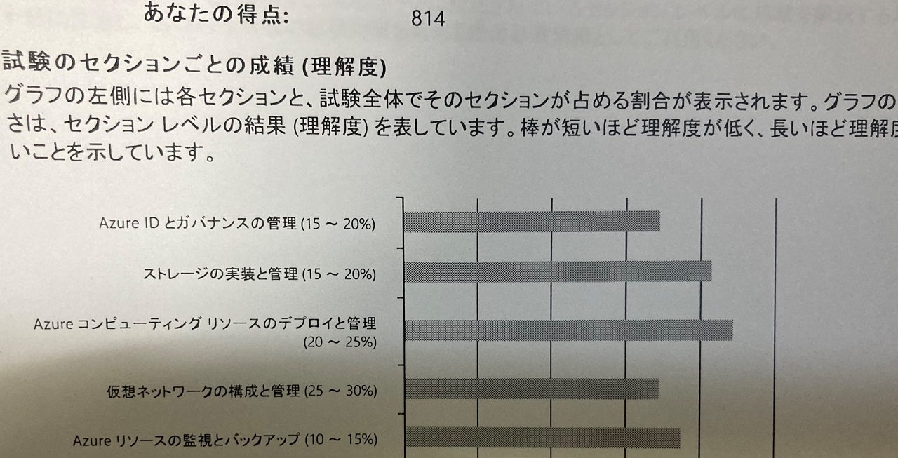

[2年以上前にAZ-103を受けて不合格だった](/posts/2019/05/25/fail-an-examination-az-103)が、今回は受かった。1000点中700点で合格で814点。Azureが使えると言っていいのかは微妙ですが、合格は合格です。

特に仕事でVM ScaleSetやLoadBalancerを使ったり、FunctionsやAppServiceを書いたり、RBACを意識してマネージドIDを活用したり、ARM Templateに苦しんでBicepに乗り換えたけど根本的な所は解決してないと気付いて辛くなったり、Azureのポータルとにらめっこしたり、と色々やってたので、その辺りで力がついたと思う。逆を言えば2年も仕事でやって自信がついていた領域で満点とれてないのが悲しい。

### 試験の受け方

今回も外の試験会場に予約を取って行った。会場は違っても流れは前回と同じ。

### 試験

全て選択問題。100分で55問？ぐらいだった。前回は180分だったので、だいぶ短くなっている。

問題形式は以下で例がある。

https://docs.microsoft.com/ja-jp/learn/certifications/exam-duration-question-types

AZ-103の時はケーススタディに入る前に見直しが入って見直し後は二度と見直しができなかった気がするが、AZ-104ではそういうのは無かった。

しかし、時間が短くなったことで1問に2分しか費やせない。問題によっては1分あれば十分なものもあれば5分あっても厳しいものがあった。結局、時間切れと同時に最後の回答をしたぐらいギリギリだった。

回答選択できる項目を先にみてから、何を答えようとしているかを先に頭に入れてから問題を読むほうが良いかもしれない。ケーススタディは特に。答える時も2分以上悩むようであれば、その時に考えてる答えを選んで見直し対象にして後で確認でも良いだろう。

あと、言葉足らずな問題が2問ぐらいあった気がする。「それ、どういう状態での話なの？Aなら1,Bなら2なんだが」という感じで回答に困るのがあった。問題文を見落としているだけなのかもしれないが。
そういう時はその時の直感で答えておき、見直し対象に含めて後で改めて考えるのがよかったと思う。

### 問題

具体的な問題については書けない。

相変わらず問題文のクセが強い。「（事前条件）があり（目的）をしたい。何をすればよいか？」といった感じ。これはAZ-103のころから変わってなかった。恐らくは1度受けないと慣れない形式だと思う。

ストレージアカウントの認証にアクセスキーやSASだけではなく、Azure AD連携(サービスプリンシパルとRBAC)を使うとか出来ることが増えているのだが、この辺りについてはまだ含まれていなさそうだった。
ただ、シークレットレスな構築ができるように進化が進んでいる感じはしているので、この辺りの移り変わりも起きると思う。結局第三者に使ってもらう時は何かしらシークレット情報を共有しないといけないのだけど。（サービスプリンシパルを公開鍵でやるとか色々やり方はあるけども、そもそもサービスプリンシパルって第三者のアプリのために払い出すのってどうなんだろう。）

### 勉強方法

ざっくり分けると以下。

- 仕事
- Azure Learn
- Udemyの動画(1200円)

仕事で範囲内のことを色々やっていたのが一番大きいが、前回と比べてAzure Learnが増えているのもポイント。

https://docs.microsoft.com/ja-jp/learn/certifications/exams/az-104

試験概要のページ（いつの間にかdocsに移ってた）で、Azure Learnが紹介されており、何を抑えればいいかをざっくり辿れるものが出てきて、勉強面では充実してきている。一通り眺めて、タイトルに分からない単語があったらそれを拾って読んだりしていた。
前回はAzure AD周りやNetwork Watcherあたり(接続モニター、IPフロー検証、NSGフローログ、パケットキャプチャ)が全く分かってなかったので、そこを少し厚く眺めてた気がする。今もよくわかってない。

しかし、試験の内容を考えるとこれだけで抑えるのはかなり無理があると思う。Learnは製品の説明や出来ることを説明していく形であり、製品の制約などを抑える必要もある。大事なところは割とLearnの内容でも書いてあるのだが、引用されたドキュメントも含めて理解する必要もあったり、謎が謎を呼びどこまで読めば理解したと言えるのか？と辛くなった。また、Learnの途中にある理解度チェックの内容は実際の問題に少し近いが、試験範囲を全くカバーできていないので、Learnだけで試験に通用するぐらい理解できるとは思えない。私の要領が悪いだけかもしれない。

で、不安だったので、Udemyでシラバスの内容を操作付き動画で説明するコースが購入した。今回は英語だったが[AZ-104 Microsoft Azure Administrator Exam Certification 2021](https://www.udemy.com/course/70533-azure/)を買った。セールで1200円。他の試験領域と被るので流用はあったものの、かなりボリュームがある。実際はトランスクリプト(文字起こし・英語）をGoogle翻訳で訳しながら2倍速で流し読みした。トランスクリプトの認識が間違ってたり、文をまたいで変な翻訳になるものの概ね理解できる内容で読めていた。

手を動かして学ぶのがやり方の一つではあるけども、分からない状態でドキュメントに従い手を動かすというのは、私は結構面倒に感じている。また**Azureはお試しでも課金が発生する**ので、その不安の中で作業する必要があり、ストレスフルであり、やる気を失いがちだと思う。Learnのサンドボックス環境もあるし、課金プランを理解できていれば変な課金は発生しないし、予算設定しなさいとか、12ヵ月の無償期間をうまくつかうとか、終わったらきちんと削除しましょうとか色々あるけど。

その点、解説動画は**分かっている人が手を動かしてやって見せてくれる**のが良くて、その不安を軽減できる。どこに何があるかをもたもた探さなくてよい。作成には時間がかかるものもあるが動画ならカットしてくれる。「そうやればいいのね」と学びもある。そういうコースが1200円で見れるのでアリだと思う。ドットインストールとかで何か学んでたりした人は良いかもしれない。

なお、1年前にUdemyで模擬試験のコースがセールで安かったので買ったものの、見ないまま放置していたらコースが削除されて見れなくなるという事があって、自分の中ではUdemyの株は下がっている。次に使うかはわからない。

他の勉強方法としては、公認のトレーニングがあったり、トレーニングを受けた人向けのWebセミナーをやっているが、トレーニングは時間拘束されるのとお高いので使っていない。

### おわり

リベンジが果たせてよかった。でも仕事に生かせるかどうかは自信がない。今まで通りやっていくだけだろうなぁ。
