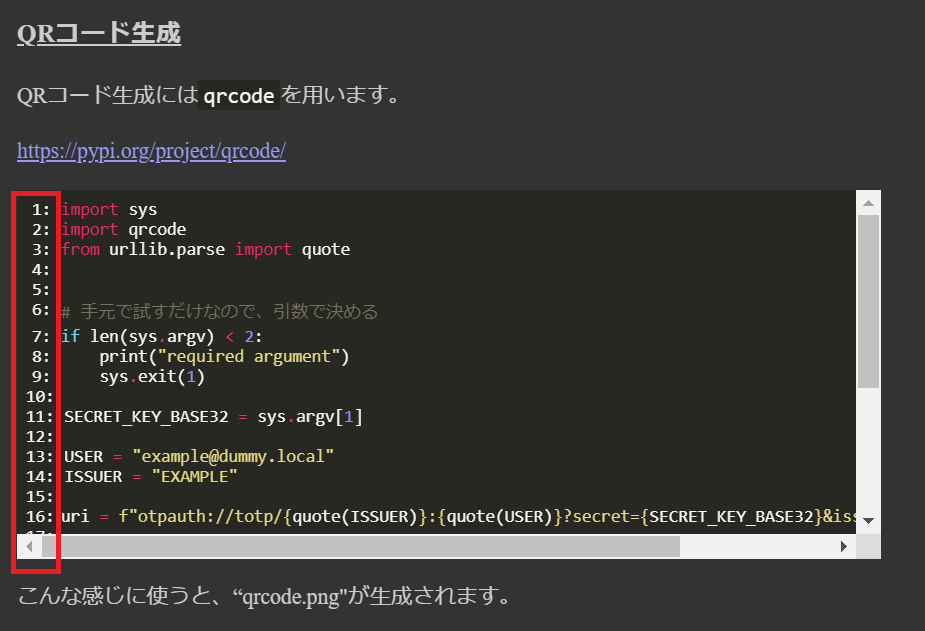
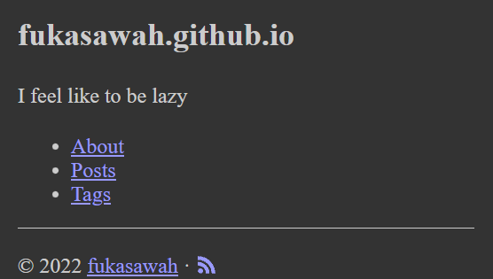
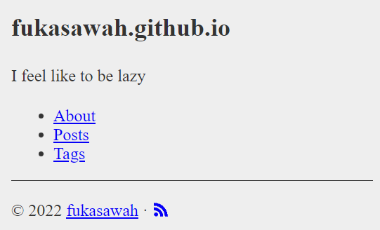
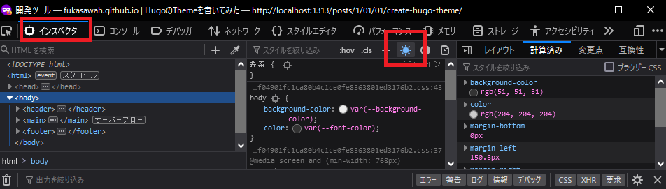
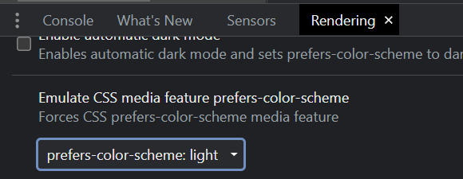
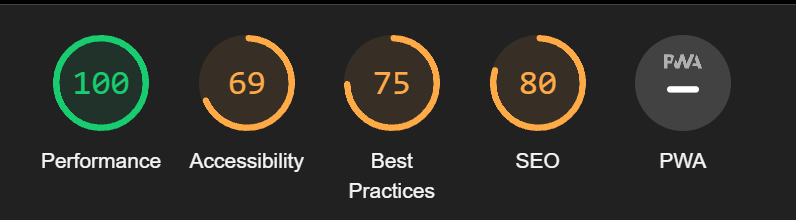

Hugoのお勉強(3年振り)

ちょこちょこテーマをカスタマイズして使っていたが、[このページに感化されて](https://justinjackson.ca/words.html) もっとシンプルなのが欲しいなと思った。

Hugoの勉強も兼ねて1から書いてみることにした。でも結局今までの振る舞いを残したかったり、細かいところにこだわり始めてしまい、シンプルじゃなくなったし、結構時間を掛けてしまった。でもおかげでだいぶ仕組みが理解できたと思う。

あと、目次を表示するか悩んだり、HTML構造上正しいのかよくわかってなかったり、アクセシビリティ的によいのかわかってなかったり、テーマを別リポジトリにしたりとかしておきたいが、一旦このまま。

以下は学んだ事とかをメモ。HugoとかHTML,CSSの事とか。


学んだこと
---------

### テンプレートを作り始める

``` bash
hugo new theme テンプレート名
```

`themes/テンプレート名` の下に色々作られる。内容はしょぼかったり、そのままでは動かなかったりするので頑張る。


### 動作が怪しいときはHugo serverを再起動

テンプレートを追加したり色々やっていると、どう考えても反映されるはずの変更が反映されないことがある。
そんなときはまずプロセスを再起動しましょう。再起動のコストはさほど高くないので、うまく反映されないなと思ったらとりあえずやるがいいと思う。

これを頭に入れておかないと、ページもホットリロードされているのに全然反映されない事象にぶつかったときに頭を悩まし続ける事となる。
（再起動しても反映されない時のほうが多かったが、原因の切り分けのためだと思って前向きにとらえる）

### シンタックスハイライト

https://gohugo.io/content-management/syntax-highlighting/

Hugoは Chroma によってコードブロックに対してシンタックスハイライト用のHTMLを生成してくれる。HTMLを作るだけなので、CSSを当ててあげないとうまくいかない。

シンタックスハイライト用のCSSは以下を参考に作る。

https://gohugo.io/content-management/syntax-highlighting/#generate-syntax-highlighter-css

``` bash
hugo gen chromastyles --style=monokai > syntax.css
```

行番号が付かないので、行番号を付けたい時は以下のCSSを当てると良い感じにつくかもしれない。

```css

.highlight {
    counter-reset: lineno;
}

.line::before {
    counter-increment: lineno;
    display: inline-block;
    text-align: right;
    content: counter(lineno) ": ";
    min-width: 2em;
}

/* スクロールバーを付けたい場合 */
pre {
    padding: 0.5em;
    max-height: 20em;
    overflow: auto;
    /* 適切な色は適当につける */
    /* background-color: var(--code-background-color); */
    /* color: var(--code-color); */
}
```



### Templateでどういう変数が使えるか悩んだ時

tl;dr: 型名を特定してAPI Docsを引きましょう

Hugoはコンテキストが存在しており、このコンテキストのときどういう変数が使えるんだっけ？と悩む時があった。

Template上はトライアンドエラーはしやすいとはいえ、使える変数をノーヒントで当てるのは非常に難しい。

そんなとき次を見つけた。

<https://gohugo.io/templates/template-debugging/>

つまり、 `{{ printf "%#v" . }}` を適当に埋め込んで画面で見るとか、わざと存在しない `{{ .FOOOO }}` などとしてビルドでエラーを起こせば型名が分かる。

（ただ、`{{ .FOOOO }}` と絶対存在しないはずなのにビルドが通る時がある。これは正直よくわかってない。mapとかだから？）

そんなこんなで型名がだいたい分かったらAPI Docsから型名を調べてメソッドを探るのがよさそう。

https://pkg.go.dev/github.com/gohugoio/hugo#section-directories

なお、 `.`(ドット)は現在のコンテキストを指す。以下のドキュメントで解説されている。

<https://gohugo.io/templates/introduction/#the-dot>


### Taxonomy Terms Templates でslugではなく名前を使いたい

どうググればいいかわからなくて結構悩んだが、以下を見ればできるはず

- https://gohugo.io/templates/taxonomy-templates/#taxonomy-terms-templates
- https://github.com/gohugoio/hugo/issues/5719


例えば、「タグ」の「一覧」のページを作りたいとする。このタグ一覧ページにはタグ名とタグのリンクと件数を一覧で出したい。

config.tomlは以下にする。

``` config.toml
# なお、tagはデフォルトのtaxonomyなので定義する必要はない。
# https://gohugo.io/content-management/taxonomies/#default-taxonomies

[taxonomies]
tag = "tags"
```

すると `layouts/tags/terms.html` ファイルを用意することで、tags特有のtaxonomy terms templatesが適用することができる。

例えば、taxonomy(例えばtags)が持つterm(項目)を列挙するページを作りたい場合はこうする。


``` layout/tags/terms.html
    <ul>
        {{ range .Data.Terms.ByCount }}
            <li>
                <a href="{{ .Page.Permalink }}/">{{ .Page.Title }}</a> ({{ .Count }})
            </li>
        {{ end }}
    </ul>
```


`.Data.Terms.ByCount` で得られるのは `hugolib.OrderedTaxonomyEntry` であり、これは `WeightedPages` が埋め込まれた型(Embedding)なので、`Page()`を呼ぶことができる、という仕組みらしい。

このあたり、ソースコードだけだと結構辛いので、API Docsを読むと分かりやすい。

https://pkg.go.dev/github.com/gohugoio/hugo@v0.105.0/resources/page#WeightedPages


なぜ`.Name`があるのに`.Page.Title`を使うのかというと、`.Name`はなぜかSlugになっているため、ちょっと見た目が悪い。
例えば `Application Insights`とかは`application-insights`いう形(slug)になってしまう。URLであれば良いが表示は元のままにしたいだろう。

### ジェネレータで作られるRSSフィードのテンプレートを書き直す

ジェネレータで作られるRSSフィードのテンプレートがちょっと古いし、Content要素など無駄にサイズが大きい割に仕様にない要素があった。

パッと見た感じ、組み込みのテンプレートがさほど悪くなさそうなので使ってもよいかもしれない。ジェネレータが作ったRSSのテンプレートファイルを削除して未指定の状態にすると、組み込みのほうが使われる。

https://gohugo.io/templates/rss/#the-embedded-rssxml

なお、今回タグ用と投稿用のRSSの内容をわずかに変えたかったので、別々に生成するようにしている。（RSSを色々用意するほどの記事は書いてないですけど）


### テンプレートにおける共通化

shortcodeはコンテンツ(markdown)でしか使えず、テンプレートには使えないようだった。

テンプレートではpartial templateを使うしかなさそう。これは引数に制約があり、[dictを使ったハックをしないといけない](https://discourse.gohugo.io/t/how-to-pass-variables-to-a-partial-template/7321)。使った例は後述。

### CSSとJavaScriptのMinifyのPartial Template化

https://gohugo.io/hugo-pipes/introduction/

Hugo Pipesにより、Minifyを行ったり、Fingerprintを計算したり、Cache bustingができるURLも用意してくれる。開発中もCSSがキャッシュされてやりづらかったのが解消できる。

resource.Get, resources.Matchで見つけられるのは `/assets`, `/themes/テーマ名/assets/` にあるものだけ。（`assets`は設定の`assetDir`で変えられるっぽい）
最初、`static`とかにあるファイルもみてくれると思ったがそんなことなかった。

`assets/js/app.js`というJavaScriptのMinifyをするだけなら以下のようにテンプレートを書く。

``` html
{{- $js := resources.Get "js/app.js" | resources.Minify | resources.Fingerprint "sha512" -}}
<script src="{{ $js.Permalink }}" integrity="{{ $js.Data.Integrity }}" defer></script>
```

resources.Getで参照するときは`assets/`は不要。それは上記の理由。

これでうまくMinifyされFingerprint計算を使いintegrity属性を設定したscriptタグを埋め込むことができる。

ただ、開発時はminifyされると分かりにくい。厄介なことに、`hugo --minify` としなくても上記のテンプレートを使うと適用されてしまう。

なので開発時はminify化したくない。また2つ以上のタグを埋め込もうとすると冗長になってしまう。それをPartial Templateで書いてみる。


``` layouts/partials/minify-js.html
{{- $js := resources.Get .src | resources.Minify | resources.Fingerprint "sha512" -}}
{{- if not hugo.IsProduction -}}
  {{- $js = resources.Get .src | resources.Fingerprint "sha512" -}}
{{- end -}}
<script src="{{ $js.Permalink }}" integrity="{{ $js.Data.Integrity }}" defer></script>
```

``` layouts/posts/single.html
...
    <!-- 埋め込む所に以下を書く -->
    {{ partial "minify-js.html" (dict "src" "js/theme-posts.js") }}
...
```

CSSも要領は同じである。（SCSSをCSSにしたいとか、SourceMapを書き出したい、とかあるかもしれないが、必要ないと思ったので今回はそこまでやらない。よくわからないというのもある。）

### CSSのlight mode/dark mode

最近のOSはダークモードをサポートしており、ブラウザも追従している。

mediaクエリの`(prefers-color-scheme: dark)`でダークモードを区別できる。

そこでこんな感じで色替えしてみた。

```css
/* not dark theme */
@media (not (prefers-color-scheme: dark)) {
    :root {
        --background-color: #EEE;
        --font-color: #333;
        --link-color: #00F;
        --link-active-color: #99F;
        --code-background-color: #EEE;
        --code-color: #333;
        --border-color: #333;
    }
}

/* dark theme */
@media (prefers-color-scheme: dark) {
    :root {
        --background-color: #333;
        --font-color: #CCC;
        --link-color: #99F;
        --link-active-color: #CCF;
        --code-background-color: #272822;
        --code-color: #f8f8f2;
        --border-color: #CCC;
    }
}
```

モードを切り替えるとこんな感じに色が変わる

|   |   |
|---|---|
|||

動作検証したい場合、Firefoxは開発者ツールで切り替えができる。



Chrome(Windows)はRenderingのオプションから設定することで切り替えができる。



Safari(iOS)だとiPhone上からでは簡単にはできず、OSの設定で切り替えることはできた。

なお、シンタックスハイライトも同じ要領で2つ用意して切り替えている。
そんなわけで、取り入れてみたものの、まぁなくても良かったかなぁ、と思ったりした。


### Lighthouseの結果をみてみた

改善の余地ありですね。

