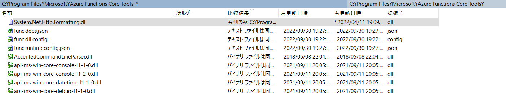

## 要約

おそらく `System.Net.Http.Formatting.dll` が何らかの理由で欠落している。

なので、`C:\Program Files\Microsoft\Azure Functions Core Tool` を開いて、`System.Net.Http.Formatting.dll` が存在するか確認する。

無ければAzure Functions Core Toolsを再インストールする。**もしダメな場合は一度アンインストールしてフォルダを削除してから再度インストールを行う**。

それでもダメな場合はこの記事では解決できないかもしれない（試行錯誤してください）

- 参考
  - [Microsoft.Azure.WebJobs.Extensions.Http でエラーになってFunctionsが起動しない | ブチザッキ](https://blog.azure.moe/2022/09/15/microsoft-azure-webjobs-extensions-http-%E3%81%A7%E3%82%A8%E3%83%A9%E3%83%BC%E3%81%AB%E3%81%AA%E3%81%A3%E3%81%A6functions%E3%81%8C%E8%B5%B7%E5%8B%95%E3%81%97%E3%81%AA%E3%81%84/)
  - [Microsoft.Azure.WebJobs.Extensions.Http: Could not load file or assembly | Stack Overflowに](https://stackoverflow.com/a/73615914)

## 環境

- .NET SDK: 6.0.305, 6.0.402
- Azure Functions Core Tools: 4.0.4590, 4.0.4829


参考までにdotnet --infoの結果

<details>
<summary>dotnet --infoの結果（事象が最後に発生したときの状態）</summary>

```
$ dotnet --info
.NET SDK:
 Version:   6.0.402
 Commit:    6862418796

ランタイム環境:
 OS Name:     Windows
 OS Version:  10.0.19044
 OS Platform: Windows
 RID:         win10-x64
 Base Path:   C:\Program Files\dotnet\sdk\6.0.402\

global.json file:
  Not found

Host:
  Version:      6.0.10
  Architecture: x64
  Commit:       5a400c212a

.NET SDKs installed:
  3.1.401 [C:\Program Files\dotnet\sdk]
  3.1.424 [C:\Program Files\dotnet\sdk]
  6.0.305 [C:\Program Files\dotnet\sdk]
  6.0.402 [C:\Program Files\dotnet\sdk]

.NET runtimes installed:
  Microsoft.AspNetCore.All 2.1.21 [C:\Program Files\dotnet\shared\Microsoft.AspNetCore.All]
  Microsoft.AspNetCore.All 2.1.30 [C:\Program Files\dotnet\shared\Microsoft.AspNetCore.All]
  Microsoft.AspNetCore.App 2.1.21 [C:\Program Files\dotnet\shared\Microsoft.AspNetCore.App]
  Microsoft.AspNetCore.App 2.1.30 [C:\Program Files\dotnet\shared\Microsoft.AspNetCore.App]
  Microsoft.AspNetCore.App 3.1.7 [C:\Program Files\dotnet\shared\Microsoft.AspNetCore.App]
  Microsoft.AspNetCore.App 3.1.30 [C:\Program Files\dotnet\shared\Microsoft.AspNetCore.App]
  Microsoft.AspNetCore.App 6.0.10 [C:\Program Files\dotnet\shared\Microsoft.AspNetCore.App]
  Microsoft.NETCore.App 2.1.21 [C:\Program Files\dotnet\shared\Microsoft.NETCore.App]
  Microsoft.NETCore.App 2.1.30 [C:\Program Files\dotnet\shared\Microsoft.NETCore.App]
  Microsoft.NETCore.App 3.1.7 [C:\Program Files\dotnet\shared\Microsoft.NETCore.App]
  Microsoft.NETCore.App 3.1.30 [C:\Program Files\dotnet\shared\Microsoft.NETCore.App]
  Microsoft.NETCore.App 6.0.10 [C:\Program Files\dotnet\shared\Microsoft.NETCore.App]
  Microsoft.WindowsDesktop.App 3.1.7 [C:\Program Files\dotnet\shared\Microsoft.WindowsDesktop.App]
  Microsoft.WindowsDesktop.App 3.1.30 [C:\Program Files\dotnet\shared\Microsoft.WindowsDesktop.App]
  Microsoft.WindowsDesktop.App 6.0.10 [C:\Program Files\dotnet\shared\Microsoft.WindowsDesktop.App]

```

</details>

### 事象

Azure Functionなプロジェクトを作り、Azure Functions Core Toolsで`func start`したら以下のエラーにぶつかった

>     Core Tools Version:       4.0.4590 Commit hash: N/A  (64-bit)
>     Function Runtime Version: 4.5.2.18383
>     System.Private.CoreLib: Could not load file or assembly 'Microsoft.Azure.WebJobs.Extensions.Http, Version=3.2.0.0, Culture=neutral, PublicKeyToken=31bf3856ad364e35'. 指定されたファイルが見つかりません。


Azure Functions Core Toolsをアップグレードを兼ねて再インストールした。するとエラーが変わり以下になった。（Core Tools versionも上がったので再インストールできていることも確認）

>     Core Tools Version:       4.0.4829 Commit hash: N/A  (64-bit)
>     Function Runtime Version: 4.11.2.19273
>     Microsoft.Azure.WebJobs.Extensions.Http: Could not load file or assembly 'System.Net.Http.Formatting, Version=5.2.8.0, Culture=neutral, PublicKeyToken=31bf3856ad364e35'.  指定されたファイルが見つかりません。.

調べるとブチザッキさんの記事が引っかかり解決できそうに思えた。

[Microsoft.Azure.WebJobs.Extensions.Http でエラーになってFunctionsが起動しない | ブチザッキ](https://blog.azure.moe/2022/09/15/microsoft-azure-webjobs-extensions-http-%E3%81%A7%E3%82%A8%E3%83%A9%E3%83%BC%E3%81%AB%E3%81%AA%E3%81%A3%E3%81%A6functions%E3%81%8C%E8%B5%B7%E5%8B%95%E3%81%97%E3%81%AA%E3%81%84/)

記事を参考に、以下を行ったが全部だめだった。

- .NET 6のSDKのアップグレード
- [Stack Overflowに引っかかった投稿](https://stackoverflow.com/a/73615914)を参考にSDKを4.1.3から4.1.1にした
- `dotnet nuget locals all --clear` でnugetのキャッシュをクリア（やけくそ）

そして、ここから他のプロジェクトで使っていたAzure Functionsプロジェクトも同様のエラーで起動できなくなったりした事も確認した。
この他のプロジェクトは.NET 6 SDKを別で用意してDOTNET_ROOT環境変数で切り替えて使っている環境なので、.NET側のSDKの問題は無いだろうと踏んだ。

Azure Functions Core Toolsをアップグレードしたのだから問題ないだろうと思っていたが、やっぱり怪しそうだった。

なので `C:\Program Files\Microsoft\Azure Functions Core Tool` フォルダをリネームし、再インストールした。

そして差分を取ると該当のファイルだけなぜか`System.Net.Http.Formatting.dll`が存在しない状態となっていた。



ここから、ちゃんと削除して再度インストールしないと配置されないのでは、と思った。

わざわざ削除するなんてことはするはずが無いし、様々な人で発生している事象だったので、何らかの理由でDLLを削除することを行っていると考えられるが、これは裏が取れていない。
（Stack OverflowあたりでもWindows Defenderが勝手に隔離するから除外に入れろという助言はあった。しかしWindows Defenderは隔離したら履歴を残すはずだが履歴は無さそうだった）

謎すぎる。