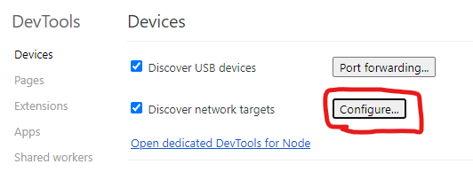
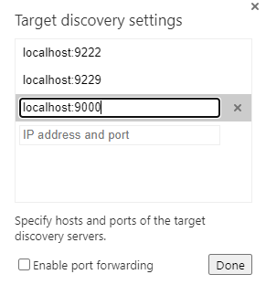
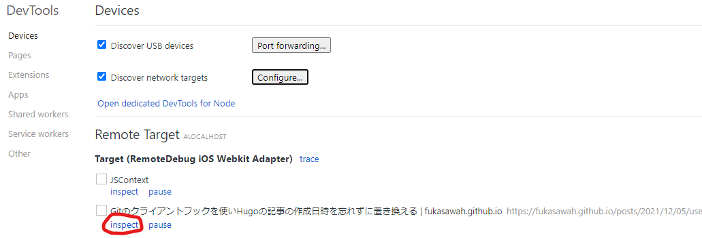
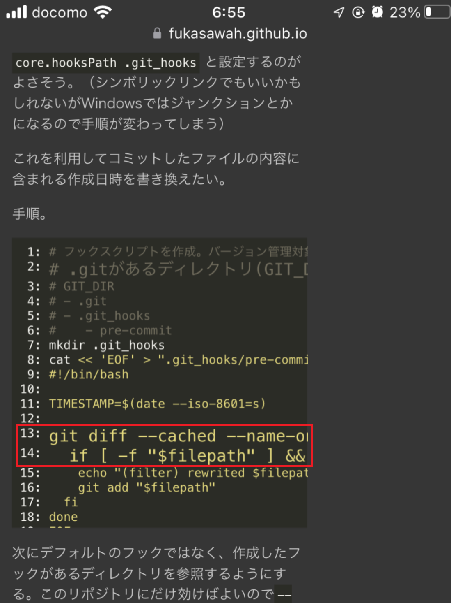
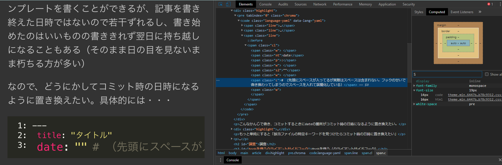

前提
------

- Windows 10
- Chrome
- Nodejs(RemoteDebug iOS WebKit Adapterを導入するため必要)
- iTunes(iPhoneの通信の都合上必要らしい)

導入
---------

### iOS WebKit Debug Proxyの導入

https://github.com/google/ios-webkit-debug-proxy

バイナリ自体は[scoop](https://scoop.sh/)というWindows向けのパッケージマネージャソフト経由で入れる。

ドキュメントに従い入れる。


起動したらiPhoneをUSBケーブルでつなぎ、Safariで開く。Safariの設定でWebインスペクタが無効担っていると以下のようなメッセージがでる。

```
PS C:\Users\fukas> ios_webkit_debug_proxy.exe
Listing devices on :9221
ssl recv failed: No error
Unable to connect to デバイス名 (00008030-001D18580E39802E)
  Please verify that Settings > Safari > Advanced > Web Inspector = ON
```

上記の通り、iPhone側のWebインスペクタが無効なので有効にしてあげる。

上手くいくと以下のようになる。ただ繋がっただけでまだデバッグはできない。

```
PS C:\Users\fukas> ios_webkit_debug_proxy.exe
Listing devices on :9221
Connected :9222 to デバイス名 (00008030-001D18580E39802E)
```

ここまで確認したら、ios_webkit_debug_proxyは一旦閉じてよい。

### RemoteDebug iOS WebKit Adapterを導入する

https://github.com/RemoteDebug/remotedebug-ios-webkit-adapter

これを入れるとChromeのdev toolsでデバッグができるようになる。要Node.js。

後は`remotedebug-ios-webkit-adapter`を実行する。こっちは9000番のポートを使い、後でchrome側でこのポートを使うよう設定する必要がある。

なお、内部で`ios_webkit_debug_proxy`を実行しているので順番に起動するとか考える必要はない。`remotedebug-ios-webkit-adapter`だけ実行すればいい。

### デバッグ開始

Chromeを開き、`chrome://inspect/#devices`を入力。

DevicesのConfigureを開く。



`localhost:9000`を追加する。




後はSafari側で操作すると、ChromeのRemote Targetにブラウジング中の一覧が出てくるので、タイトルから対象を見つけてinspectをクリックする。



少々操作感が違うが、これでいつも通りのchrome dev toolsを使ったデバッグができるだろう。

フル機能ではないが、もちろんCSSを修正すると実機も変化するし、JSを実行することも、Breakpointも効く。


デバッグ
------------

### 事象

まず事象が起きているところ。iPhoneで撮影したもの。



こんな感じでフォントサイズが不規則に大きくなることがあった。変なスタイルが当たっているに違いないと思ったので、デバッガで見てみたいというのがモチベーションだった。

### デバッガで見てみる

デバッガでみたところ、やはりなぜかfont-sizeが19pxになっている。




しかし、CSS自体はちゃんと14pxで絶対値で指定しているので、大きくなるはずがない…デバッガではこれ以上よくわからなかった。

### 解決へ

結局 `font-size safari 大きくなる` で調べたところ、`-webkit-text-size-adjust: 100%`を効かせればよいらしい。
こんなの部分的に適用してほしくないので、bodyで指定した。

今回はデバッガを使うまでもなかったけど、今後はsafariのデザインも微調整できそう。デザインセンスないけど。
