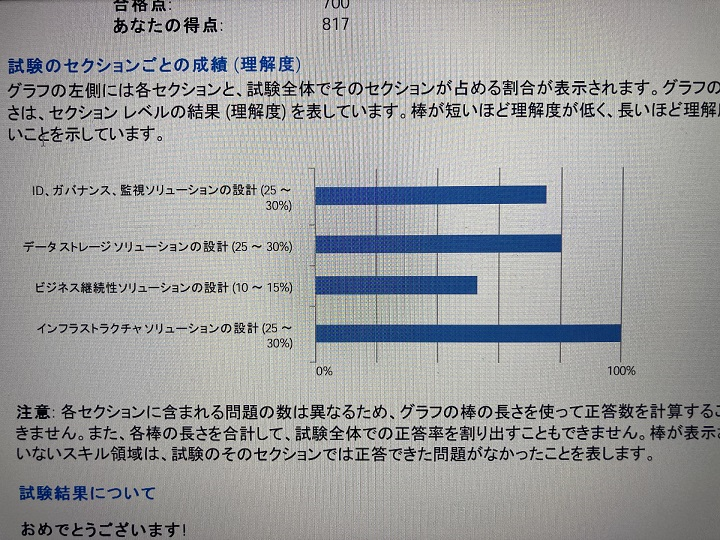

今回は[AZ-305](https://learn.microsoft.com/ja-jp/certifications/exams/az-305)受けました。[3か月ぐらい前にAZ-204を受けた](/posts/2022/09/exam-az-204/index.md)。[履歴はタグを眺めると分かるかも](/tags/mcp/)。

結果は817点で合格でした。年内に取ろうと思っていたので受かってよかった。

セクションごとの成績はこんな感じ。

今回も部屋が汚いので試験センターで受けてきました。

### やったこと

MicrosoftのEnterprise Skills Initiative(ESI)という制度を始めていて、私も利用できたので利用させてもらった（色々条件が変わったので来年度には消えそう）

ESIのメリットは受験料が免除され、模擬試験も無料で受けられる。この模擬試験は結構しっかりしていて「なぜその回答が間違いか」まで教えてくれる。試験内容もかなり現実の試験に近い内容になっていた。模擬試験は150問近くあり、出題内容や項目をある程度いじれるので苦手な項目だけ解くという事はできる（問題は決まっているので覚えてしまうと何の意味もないが）

150モンを6時間かけて~~ダラダラしながら~~回答したところ、80%ぐらいだった。これは回答を確認しながら1問1問答えてたのでカンニングに近いような感じではあったのでもう少し取りたかった。

ADとDBとビジネス継続性がだいぶ悲惨だったので、そこだけLearnで眺め直した。正直SQL Databaseは多いしプランも多いしで何ができるのか・できないのか結局今も良く分かってない（サービス名を並べて違う点を比較表に書き出してたりした。こういうのは清書して公開したいが、変化していく部分もあるので面倒になってしまう）

### やったほうがいいこと

試験範囲に何が出てくるかを抑えるにはやはり[資格ページの学習ガイド](https://learn.microsoft.com/ja-jp/certifications/exams/az-305)だけでは取っ掛かりが少なすぎる。Learnをとりあえずこなしたり、ESIの模擬試験やUdemyの模擬試験などを見て具体的な問題からサービス名を拾って調べていくのが良い。

あと、試験対策というより、単純にそのサービスを知るには`learn.microsoft.com`の製品ドキュメントを見るのが一番。よほど詳しい人が書いてる内容でなければまずはここを読みましょう。

`learn.microsoft.com`はセールストークや横文字でそれっぽい記述が並んでいて読みにくくても、なんだかんだで書いてある。（ニッチな挙動については書いてなくてgithubですったもんだしてるときもある）

ドキュメントでは以下のワードを抑えると良い。

- 「概要（Overview）」を見て大まかに知る。セールストーク多めなので睡魔に負けないように頑張ろう。
- 「概念（Concepts）」でサービスの用語と意味を知る。ここで抑えておかないと、チュートリアルや他で知らん単語が急に出てきて理解不能になり死ぬ。
- 「制限（Limits, Quota）」でサービスにまつわる制限を知る。制限は意外と多いし、緩和できる制限(quota)も注目しておく。
- 「FAQ」でサービスにまつわる落とし穴（制限など）を知る。FAQがわざわざあるという事は執筆者がわかりにくいと思っているorわからないユーザが多くいる部分だと思う。

これを「Azure サービス名 ワード」で調べてヒットした`learn.microsoft.com`をひたすら読むのが良い。これが確実。

最高なのは金を払って手で動かすこと。大抵はチュートリアルが用意されているので、それに従ってまずはやってみる。

あと、前にも書いた通り、Azureはゾーン冗長性、マネージドIDを使ったキーレスな権限管理(RBAC)、Private Linkを使ったマネージドサービスとプライベートネットワークの繋ぎ合わせを推している。この辺りの問題もそこそこでる。このあたりは大抵ドキュメントの概念やチュートリアル辺りに書かれている。

### 思っていること

Azureのサービス名が似たものが多く、何が何だかわからなさすぎる。

Azure Cosmos DB for PostgreSQLとか[Azure Database for PostgreSQL Hyperscaleをリネームしただけ](https://learn.microsoft.com/ja-jp/azure/postgresql/hyperscale/moved)みたいだし、Cosmos DB要素がない。ちゃんとそういうサービス名にコンセプトを持たせてるならそう明言してほしい。多分今後はリージョンレベルで分散しているデータストアをCosmos DBって読んでいきたいんだろうけど、わかりにくい。

Azure SQL（特にSQLServer）はこの手のサービスとプランが乱立しており、違いを把握するのが非常に大変。そして運用してみると想定外なことが起きて制限に引っかかり「それしたければ別のサービスorプラン使わないとダメよ」とかよくある。

この辺りを抑えられたら君もそりゅーしょんずあーきてくとえきすぱーとだ！！
