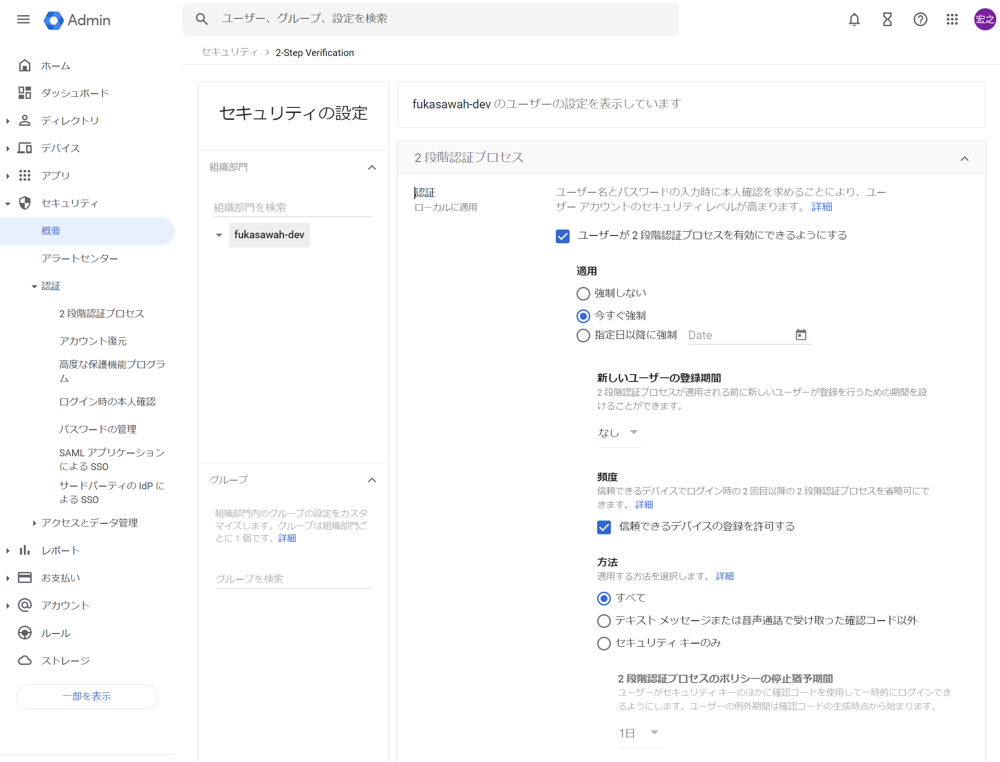
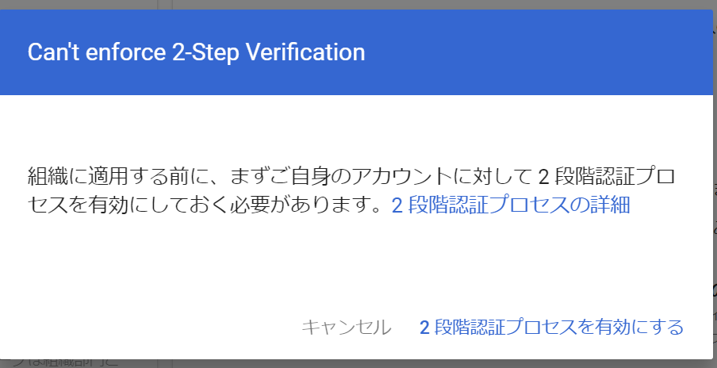
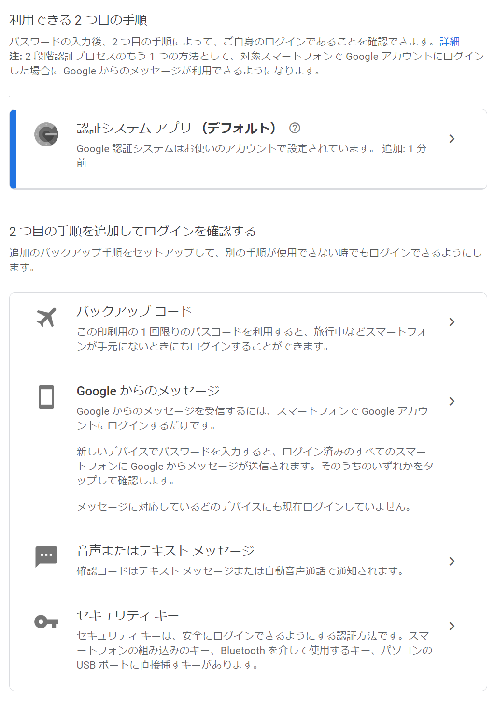
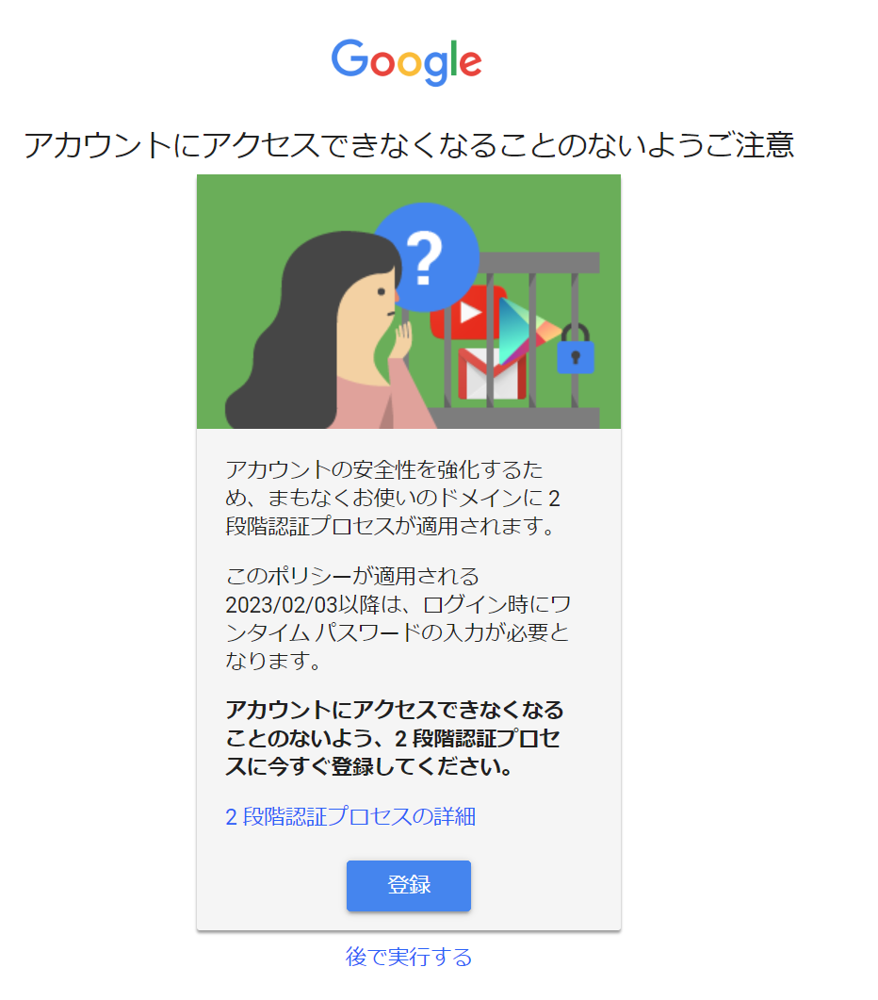
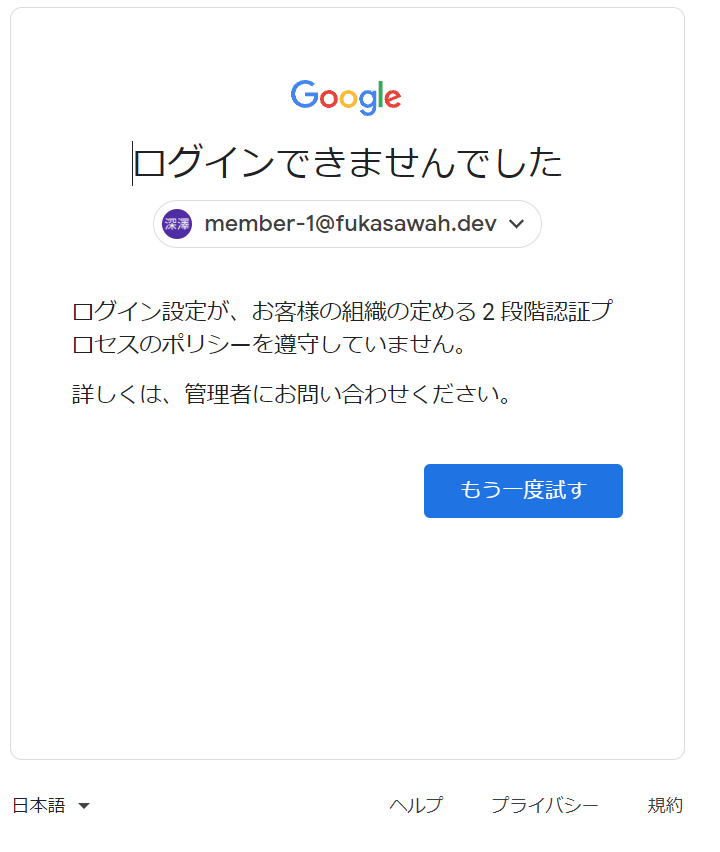

Google Workspace用の設定が良く出てくるが、今回はGoogle Cloud Identityで設定したい。

Google Cloud Identityで2段階認証を強制したい（管理者作業）
-------------------
[管理者画面](https://admin.google.com/)にある [2段階認証](https://admin.google.com/u/3/ac/security/2sv) から行える模様。

以下は設定したほうがよさそう。

-  新しいユーザーの登録期間: 猶予を与えてやらないとユーザ作成後、即座に締め出されてしまう（ログインもできなくなる）
-  方法: まずは「全て」がよさそう。電話を認めないと多分大変。後述。

設定したら保存。

設定すると「まずお前からだ」といわれるので設定する。手順はユーザと同じなので次を参考。

2段階認証を設定する（管理者・ユーザ作業）
----------------

この作業はGoogleアカウントも Google Cloud identityで管理されているアカウントでも同様に行えるはず。

[https://myaccount.google.com/security] を開き、「2段階認証プロセス」を選択して設定していくだけ。

2段階認証プロセスは以下が用意されている。

- セキュリティキー: Yubikeyや生体認証装置を使った物理キーを使った認証
- Googleからのメッセージ（Googleアプリ）: スマートフォンにGoogleアプリを導入し、デバイスで認証する
- 認証システム アプリ: Google AuthenticatorやMicrosoft Authenticator等のTOTPを発行できるアプリで認証する
- 音声またはテキストメッセージ: 電話による通話かSMSを使ったワンタイムパスワードを入力して認証する
- バックアップコード: ランダムに払い出された番号を記憶して起き、ログイン時に使うことで認証する。1個につき1回限り。

まずは「認証システム アプリ」が無難。SMSや電話は手軽だが、認証コードの通知が待ち受けに出たり、電話はそのまま出たりできてしまう。なのでデバイスさえ入手出来たら見れてしまうため内部犯とかに弱い。（それでも所有を認証にできるのでパスワードのみと比べたら充分強固）

・・・なのだけど、このうち「認証システム アプリ」と「バックアップコード」は選べなかった。

気になる点
------------

### 2段階認証プロセスの「選択」と、初回で選べるプロセス

Googleが提供してる2段階認証の方法は以下がある。

それに対して方法の選択が「全て」「テキスト～確認コード以外」「セキュリティキーのみ 」なぜか3つしかない。

どれを選べばどれができるのか？わからなかったので試してみた。

| 「方法」の選択           | セキュリティキー | Google アプリ | 音声またはテキストメッセージ | 認証システム アプリ | バックアップ コード |
| ------------------------ | ---------------- | ------------- | ---- | ------------------- | ------------------- |
| 全て                     | ◯                | ◯             | ◯    | -                   | -                   |
| テキスト～確認コード以外 | ◯                | ◯             | -    | -                   | -                   |
| セキュリティキーのみ     | ◯                | -             | -    | -                   | -                   |

2023/01/27時点：なぜか「認証システム アプリ」が何故か初手では選べない（後から追加で設定はできる）

なのでまずは「全て」が良いかと思う。

### 2段階認証の初回設定時に「認証システム アプリ」が選べないんだけど？

上述の通り「認証システム アプリ」は初回に選択できないが、後から設定することができる。

ちょっと面倒だが最初は「音声またはテキストメッセージ」で登録を済ませ、後から追加で「認証システム アプリ」を登録する。その状態ならば「音声またはテキストメッセージ」を削除することができる。

ちなみに、バックアップ コードは2段階認証としては認められないらしく、これだけを残すことはできなさそうだった。（デバイスを持たない人しか使えないのでそういうものだと思う）

### ログイン済みのユーザがいる状態で2段階認証を強制したらどうなるか？

既存のログイン済みのユーザには即座に2段階認証がかからずログインしたまま作業できてしまうので注意する（20分程度では反映されなかっただけかもしれない）

ログアウトして新たにログインしようとすると、ちゃんと警告が出る。

### 猶予期間中にログインしたらどうなるのか？

猶予の期間内だとログイン時は以下のような画面が出て、設定画面に遷移するか、無視することができる。設定しましょう。

### 猶予期間外にログインしたらどうなるのか？

締め出しを食らった状態になる。猶予期間は設けたほうがよいでしょう。

