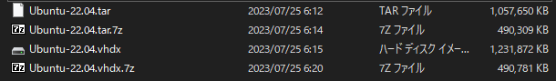
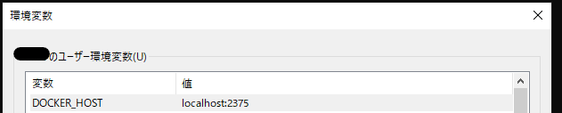
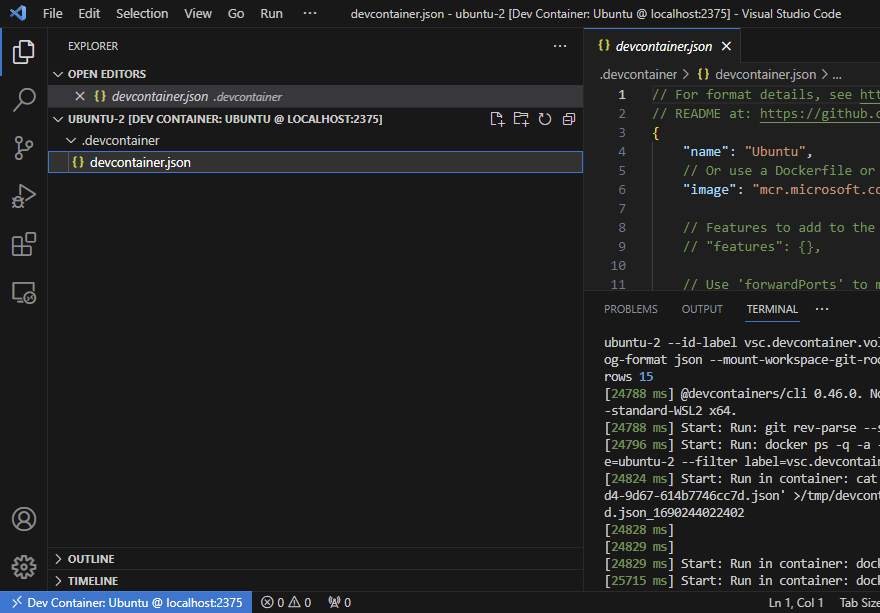

背景
-----------

Windowsでdevcontainerを使った汎用的な開発環境を整えられるようにしたい。

devcontainerはコンテナを動かしたりするための環境としてDockerdが必要。

大抵はDocker Desktopを前提にしているが、Docker Desktopはライセンスの都合がある。会社の稟議とか色々作業が発生して面倒なので、それに代わる方法を検討したい。

大まかな作業は以下。

- WSLにSystemdを導入する
- WSLにDockerdを導入する
- Windowsホスト機からWSL上のDockerdと疎通が行えるようにする

WindowsにDocker CLIバイナリをインストールする
----------------

調べるとすぐ出てくるのはDocker Desktopをインストールするほう。これとは別にバイナリは配布されているのでそれを使う。

https://docs.docker.com/engine/install/binaries/#install-server-and-client-binaries-on-windows

次のあたりからダウンロードしてPATHが通る場所に配置しておく。PATHの通し方は解説しない。

https://download.docker.com/win/static/stable/x86_64/


WSL上でDockerdを動かす
----------------

一応、Ubuntuのdistroを使うことでUbuntuの手順でDockerdを動かすことができる。

ただ、Systemdに対応しないと色々不便。distoro起動後にコンソールへ入ってdockerdを手動で起動するとかしないといけない。なのでその辺りを含めて書く。

### WSL2にアップグレードする

今はWSL→WSL2→WSL 1.0と遷移しているけど、ドキュメントはまだまだ置き換わっていないので、WSL2と呼ぶ。

```bash
wsl --update

```

```bash
wsl --list --online
```

```bash
wsl --install Ubuntu-22.04
```

```log
>wsl --install Ubuntu-22.04
インストール中: Ubuntu 22.04 LTS
Ubuntu 22.04 LTS がインストールされました。
Ubuntu 22.04 LTS を起動しています...
Installing, this may take a few minutes...
Please create a default UNIX user account. The username does not need to match your Windows username.
For more information visit: https://aka.ms/wslusers
Enter new UNIX username: fukasawah
New password:
Retype new password:
passwd: password updated successfully
この操作を正しく終了しました。


Installation successful!
```

上記の通り、インストール後即座にdistoroが起動し、初回はユーザ設定を求められるので適当に設定する。

### (WSL)(任意) ログインユーザを変更

<https://learn.microsoft.com/en-us/windows/wsl/wsl-config#wslconf>

デフォルトではrootでログインしてしまう。
ローカルの開発環境なので別にこれでもよいとも思うが、普段からLinuxのお作法に慣れたい場合はログインユーザを変更しておく。

```bash

sudo tee -a /etc/wsl.conf << __EOF__ 

[user]
default=ユーザ名
__EOF__
```

### (WSL)(任意) distoroのExport/Importで同じdistoroを複数作れるようにする

残念ながら現状、インストールしたdistoroは1個しか入れられない。これは環境を完全に分けたい場合に困る。

ただdistoroをexportしてバックアップし、必要に応じて別名のdistroとしてimportできるのでこれで代替する。これは以下のメリットがある。

- 同じdistoroの環境を複数用意できる
- システムドライブ以外に保存できる

これにメリットを感じない人は本手順をスキップしてよい。
（アンインストールして再度インストールすればよいという話でもあるので）

以下は読み替えて実行する。

- 対象Distoro: `Ubuntu-22.04`
- バックアップ先: `D:\wsl\backup\Ubuntu-22.04.vhdx`
- import時のDistoro名: `Ubuntu-22.04-1`
- import先Location: `D:\wsl\distoro\Ubuntu-22.04-1`

```bash
# 一度WSLを止める
wsl --shutdown

# ディレクトリ作成
mkdir D:\wsl\backup
mkdir D:\wsl\distoro

# 既存のdistroのExportと別名でImport
# デフォルトはtar形式で --vhd オプションでVHDX形式になる。
# VHDXのほうがtarと比べてファイルサイズは大きくなるが、ファイルのコピーのみでimport/exportでき速度が圧倒的に早い
wsl --export "Ubuntu-22.04" "D:\wsl\backup\Ubuntu-22.04.vhdx" --vhd
wsl --import "Ubuntu-22.04-1" "D:\wsl\distoro\Ubuntu-22.04-1" "D:\wsl\backup\Ubuntu-22.04.vhdx" --vhd
```

参考までにサイズ感。



この手順で作られるファイルの関係はこんな感じになる。

```log
D:\
└─wsl
    ├─backup
    │      Ubuntu-22.04.vhdx : バックアップしたdistoro
    │
    └─distoro
        └─Ubuntu-22.04-1
                ext4.vhdx : 操作に使うdistoro
```

import後はそのdistoroを起動する。必要に応じてデフォルト実行にする。

```bash
# defaultのdistroに設定(`wsl`とだけ打った場合に実行されるdistro)
wsl --set-default Ubuntu-22.04-1

# wsl --distribution Ubuntu-22.04-1 で起動する。"ユーザ名"は適宜変更
wsl --distribution Ubuntu-22.04-1 --user ユーザ名
```

### (WSL)Systemdを動かす

次に従う。

<https://learn.microsoft.com/ja-jp/windows/wsl/systemd>

要はWSL内で `/etc/wsl.conf` を書いたら、ホスト側で一度`wsl --shutdown`して、再度起動するだけ。

```bash
sudo tee -a /etc/wsl.conf << __EOF__ 

[boot]wsl
systemd=true
__EOF__
```

再起動したらsystemdで動作しているので、systemctl等が使えるようになる。

```bash
sytstemctl status
```

`State: running` となっていればsystemdが起動できている。
`State: degraded`となっている場合はおそらくsystemdではないデフォルトのinitプロセスが動作してしまっている。

### (WSL)Dockerdを導入する

Dockerの公式のドキュメントに従う。distoroはなんでもいいがUbuntu 22.04 LTSを前提にした場合、Ubuntuの手順がそのまま使える。

<https://docs.docker.com/engine/install/ubuntu/>

`sudo docker run hello-world` が動作するところまでを確認する。

これでWSLのdistoroが起動すればDockerdも起動する状態となる（逆を言えば起動しないといけない）

### (WSL)ログインユーザがsudo無しでdockerコマンドを操作できるようにする

```bash
sudo usermod -aG docker $USER
```

これを行うことで任意のコンテナを実行できてしまうので、それが問題になる可能性はあるが、通常は開発者自身しか触らない環境なので一旦許容する。

### (WSL)DockerdをWindowsホスト側からアクセスできるようにする

systemdでdockerデーモンを起動する場合、`-H fd://` が効いているため、`/etc/docker/daemon.json`の`hosts`を参照しない。

```
$ cat /lib/systemd/system/docker.service | grep "ExecStart"
ExecStart=/usr/bin/dockerd -H fd:// --containerd=/run/containerd/containerd.sock
```

これはWSL内でしかdockerを扱えない事を意味する。そのため、`-H fd://`を除去する。

```bash
# systemdのdockerのユニットファイルの修正
sudo sed -i.bak 's# -H fd://##g' '/lib/systemd/system/docker.service'

# /etc/docker/daemon.json を書き換え
# hostsの意味
# - unix:///var/run/docker.sock : デフォルトの動作の互換のため（一応WSL内で扱えるようにしておく）
# - tcp://127.0.0.1:2375        : Windowsホスト機からアクセスするため
sudo tee /etc/docker/daemon.json << "__EOF__" 
{
    "hosts":["unix:///var/run/docker.sock", "tcp://127.0.0.1:2375"]
}
__EOF__

# Systemdのdaemon-reloadでユニットファイルの内容を反映
sudo systemctl daemon-reload

# dockerデーモン再起動
sudo systemctl restart docker
```

ポート番号の都合が悪い場合、適宜変更する。

### (ホスト)Windowsホスト機の環境変数を調整

dockerdはWSL上のモノを使いたいので、環境変数として以下を設定する。

| キー名        | 値               |
| ------------- | ---------------- |
| `DOCKER_HOST` | `localhost:2375` |



### (ホスト)Windowsホスト機からの疎通確認

curlがある場合は `curl http://localhost:2375/info`で疎通がとれる。

```log
>curl http://localhost:2375/info
{"ID":"5552d32e-2980-4139-a844-19241121d1c0","Containers":1,...
```

Windowsホスト機にDocker CLIが入っている場合、環境変数DOCKER_HOSTを設定した上で`docker info`で確認できる。

```log
>docker info
Containers: 1
 Running: 0
...
```

動作確認
-------------

`Dev Containers: New Dev Container...` を使い新たにdevcontainer環境を作ってみる。

イメージは何でも良いが、Ubuntuを選択してみた。

うまくいくとVSCodeのWindowが開きなおされ、`.devcontainer/devcontainer.json`が作成された状態になった。



これをGitで管理すればあとは開発環境を共有できるはず。次回はその辺りを使いこんでみたい。

トラブルシューティング
-------------

### dockerの操作時に `\\.\pipe\docker_engine` にアクセスしようとする

```log
error during connect: Get http://%2F%2F.%2Fpipe%2Fdocker_engine/v1.32/version: open //./pipe/docker_engine: The system cannot find the file specified. In the default daemon configuration on Windows, the docker client must be run elevated to connect. This error may also indicate that the docker daemon is not running.
```

VSCodeで`Dev Containers: New Dev Container...` を実行しようとしたときにエラー。デフォルトは `\\.pipe\docker_engine`にアクセスしようとするが、こんなファイルは無いのでエラーになる。

VSCodeでの`Dev Containers: New Dev Container...` はリモートのVSCode Serverではなくホスト側のVSCode(Client)で動作するようだった。つまりホスト機からdockerの疎通が必要だった。

ホスト機のこの接続先についてはDOCKER_HOSTの環境変数を用意するのが手っ取り早い。そのため手順に含めている。

### Unknown shorthand flag: 'w' in -w

これもVSCodeで`Dev Containers: New Dev Container...` を実行しようとしたときにエラー。

```log
[18449 ms] Start: Run in container: node /root/.vscode-remote-containers/dist/dev-containers-cli-0.299.0/dist/spec-node/devContainersSpecCLI.js read-configuration --workspace-folder /workspaces/ubuntu --id-label vsc.devcontainer.volume.name=ubuntu --id-label vsc.devcontainer.volume.folder=ubuntu --log-level debug --log-format json --mount-workspace-git-root true --terminal-columns 117 --terminal-rows 15
[20599 ms] unknown shorthand flag: 'w' in -w
[20600 ms] See 'docker exec --help'.
```

見ての通り、`docker exec`に `-w` なんてオプションは無いというエラー。

調べた感じ、Docker CLI(docker client)のバージョンが古いと発生するようだった。

Windowsホスト機の`docker version`を確認する。自分の環境はDocker CLIが`17.09.0-ce`と古すぎた。何年前だ。

最新版は次とかから探す。

https://download.docker.com/win/static/stable/x86_64/

WindowsはDocker Desktop使えと案内されがちだがちゃんとDocker CLIも別途配布されている。

思い出話
------------

### WSLとSystemdの思い出

私はWSL1(1.0ではない)の頃から、WSLでSystemdが使えればなぁ、と思っていて、WSL2が出た時も同じことを思っていた。
WSL自体がコンテナなので、余計なものを動かすなというのはあるのだけど、開発時はやっぱり色々起動するので欲しくなる。

しかしsystemdをインストールすればいいんでしょ？ という話でもなく、私ではできなかった。

で、それを実現する[Distrod](https://github.com/nullpo-head/wsl-distrod)が出てきてびっくりした。[スライド](https://speakerdeck.com/nullpo_head/systemdnowsldeisutorowozuo-ru)を見てよくわからんけどスゲー！ と思いながら眺めてた。

でも仕事で使うのに説得するのは無理そうだなぁ、と見送っていたらWSLのほうでSystemdサポートが入った。
もちろん[Distrodのnullpo_head氏も謝辞に入っていた](https://devblogs.microsoft.com/commandline/systemd-support-is-now-available-in-wsl/)。

世の中、一部の人の凄い貢献で動いている感じがあり悪い気がしつつも、私にはなんもできないので、感謝しかない。
