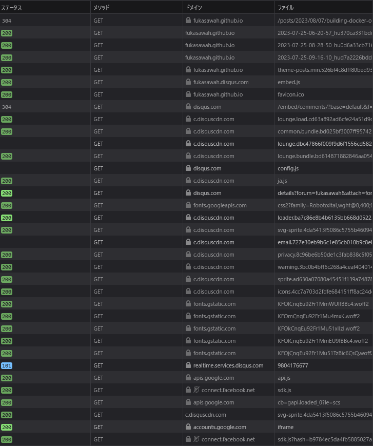
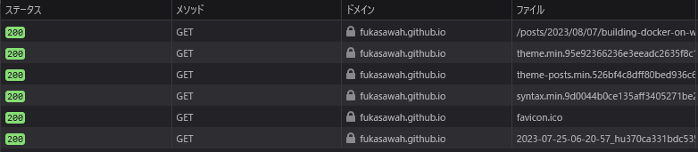

このBlogでDisqusやめましたというだけ。Google Analyticsは結構前からやめてます。

まず気になったのが結構な量のコンテンツを送り付けている所。ファイル数だけで見てもサイズで見ても倍以上送ってる。うちの記事にそんな価値ないと思っている。

ファイル数からして全然違う。サイズはキャプチャし忘れたけど同じく倍以上。キャッシュはそこそこ効いてるのだけど、それでも最初は効かないので。

設置した意図としてはフィードバックをもらいたいなとは思っていた。でも今まで1件もコメント無かった。その程度の記事しか書けていないということだろう。あと単純にDisqusでコメントつける人がうちのサイトに来ない気がする。
Qiitaでもいくつか記事を書いてるけど、コメントはほとんどない。内容がニッチすぎるのが原因な気はするけど。ただ「役に立ちました」みたいなコメントがついたときはやっぱり嬉しい。そういうのも求めていたのかもしれない。

でも私はコメントをもらうために記事を書いているわけではなくて、単純に困ったりやったことを記事にして、それがいつか未来の自分を含めた誰かの役に立てばよいと思って書いているのだと思った。だったら少しでも転送量を減らして、ギガを気にせず読んでもらうほうが良いと思った。
