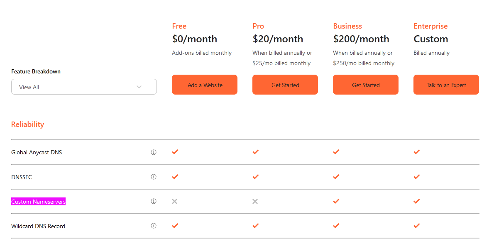
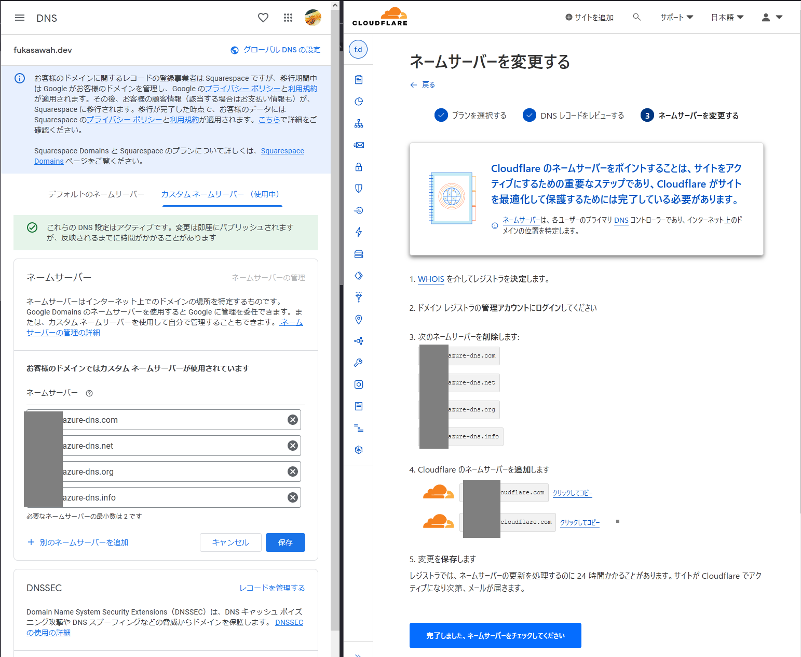
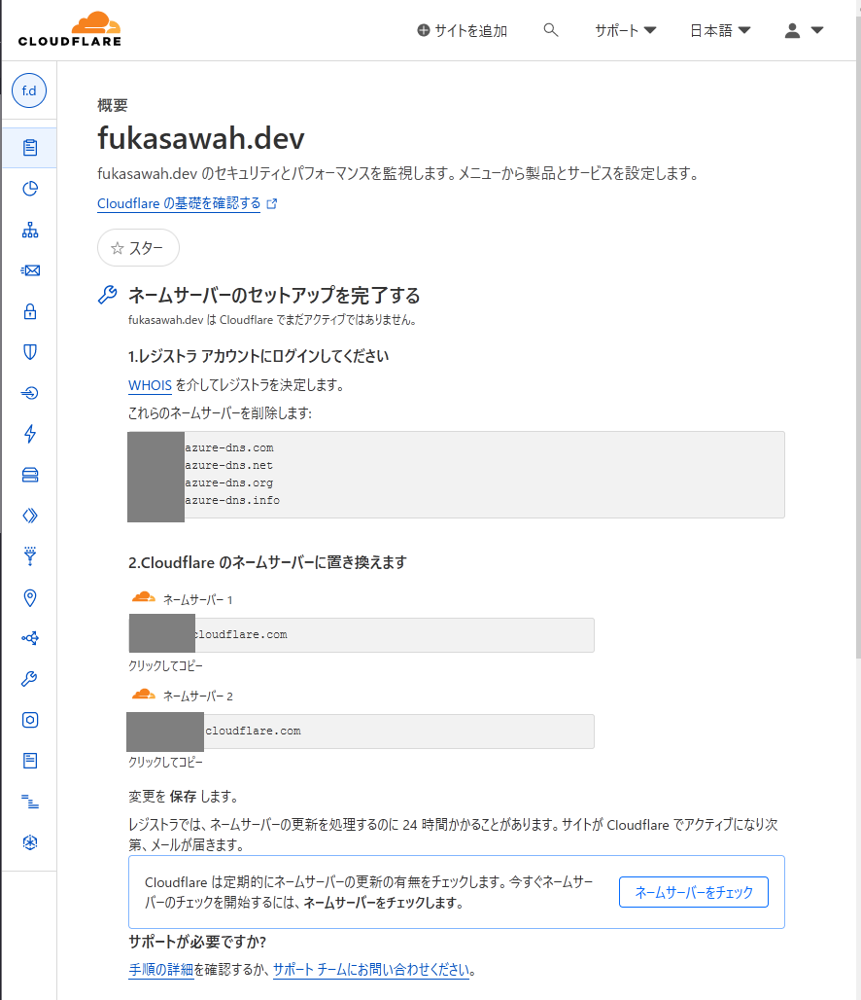
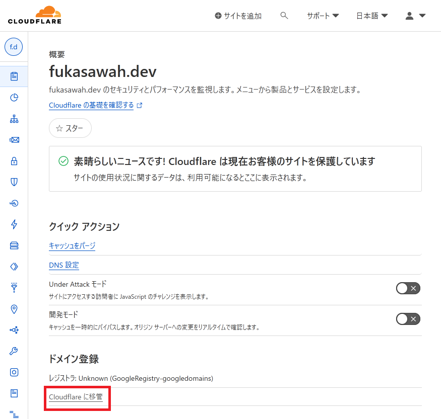
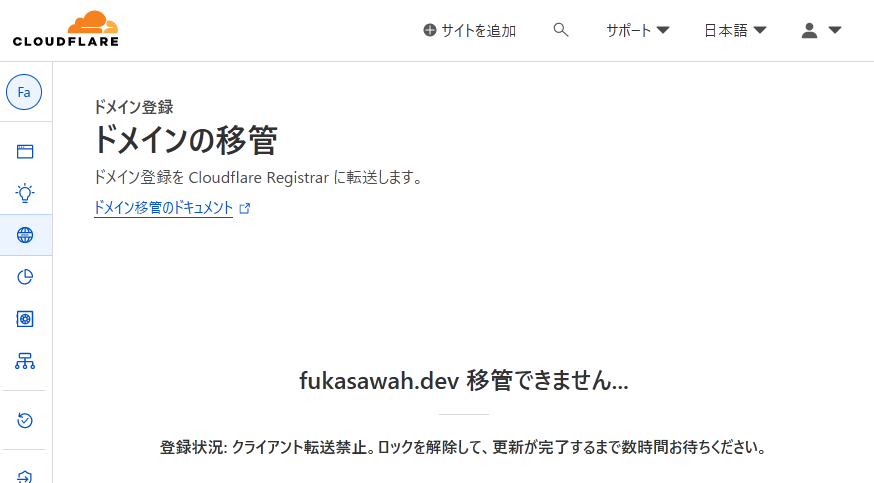
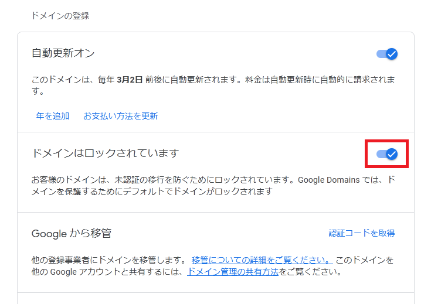
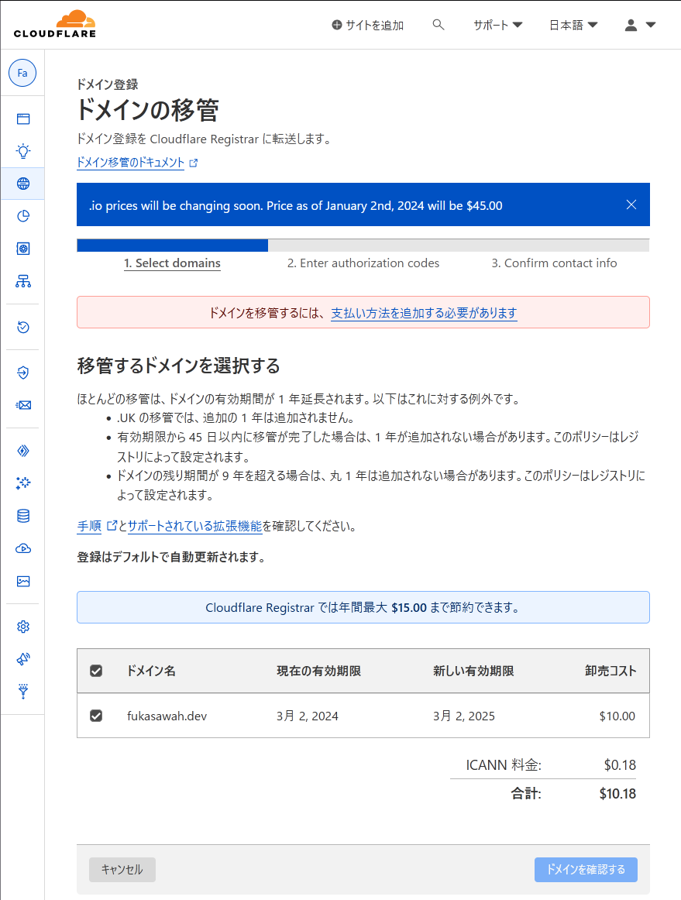
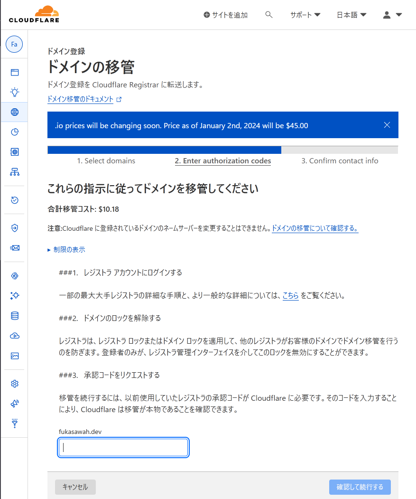
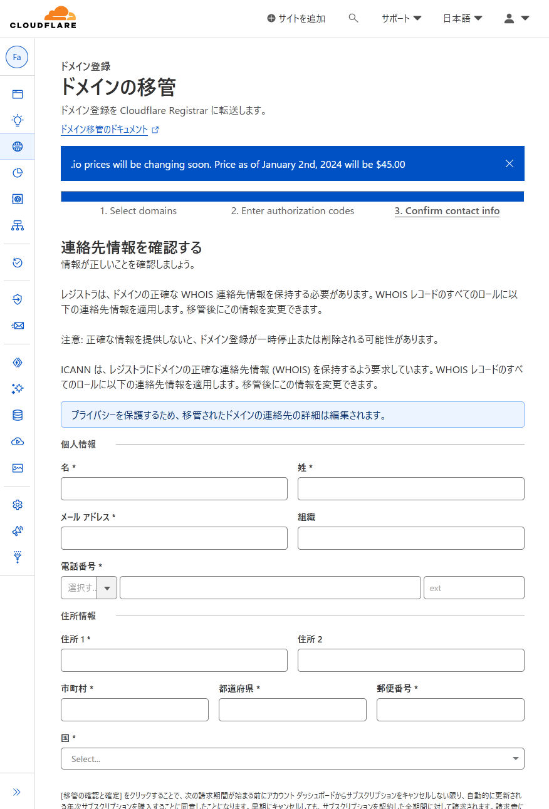
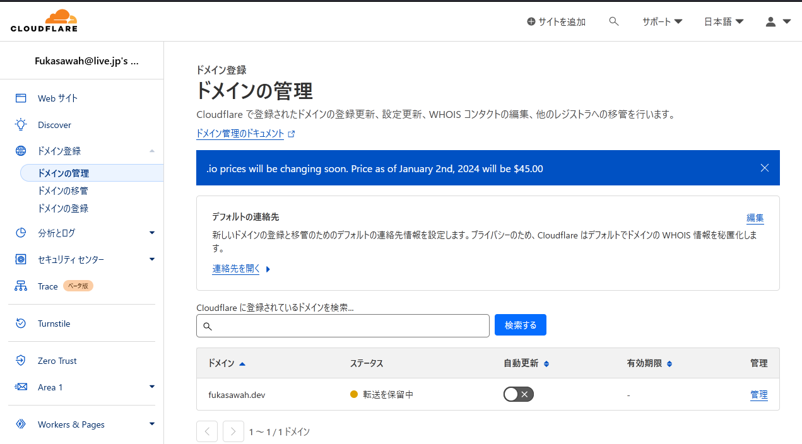

Google domainで取ったfukasawah.devというドメインがなんかよくわからない所に移されてしまうらしい。そういえばドメインの移管というのをやったことないな、と思ったので試してみたいと思った。国内のドメインレジストラはなんかぱっとしなかったので、Cloudflareのモノを試してみることにした。

先に注意として、[Cloudflareにおけるカスタムネームサーバ機能は要Businessプラン(有料)](https://www.cloudflare.com/plans/)なので、これも利用したいなら、他のレジストラにしたほうがよい。

手順
----------

以下の手順を見ながらやったが、結構アドリブが必要だったり待ち時間があったりで1時間ぐらいかかった。

https://developers.cloudflare.com/registrar/get-started/transfer-domain-to-cloudflare/

### Cloudflareアカウントを作る

手順で「[Create a Cloudflare account.](https://developers.cloudflare.com/fundamentals/setup/account-setup/create-account/)」とあるので従う。

メールアドレスとパスワードを入れて作成。メールが来るので認証を済ませるだけ。

ついでに[2段階認証](https://dash.cloudflare.com/profile/authentication)も設定し、日本語化もする。

BestPracticeでチームやビジネス用ならエイリアス（メーリングリスト）を使え、とある。

エイリアスと聞いて余計なことを思い出したのでそれをすることにした。私はOutlookをフリーメールとして使っており、ここは「サブアドレス指定, プラスアドレス機能」というのが使える。`account@hotmail.com`のエイリアスとして`account+alias1@hotmail.com`というようなアドレスを作業無しで作ることができる。ちなみに、これとは別に「エイリアスの追加」という別のメールアドレス（例えば`alias2@outlook.jp`）をエイリアスに使うこともできる（こちらは[ここ](https://account.live.com/AddAssocId)で設定作業が必要）なので、`account+cloudflare@hotmail.com`みたいなアドレスを登録することにした。なんかあったら戻す。

### Webサイトを追加する

https://developers.cloudflare.com/fundamentals/setup/account-setup/add-site/

別にWebサイトとして使いたいわけじゃないんだけどな、と思いつつもとりあえず作業する。

まず移管する予定のドメインで登録。

プラン選択を要求される。ドメイン移管したいだけなので、まだ他の機能を使うつもりはないため、Freeプランを選択。

「～ DNS レコードを追加する」という作業があるが、何もしなくてよさそう。

> レコードを後で追加する
> 
> DNS レコードなしでは、Cloudflare はサイトをアクティブにすることができません。DNS レコードを今すぐ設定する必要があります。

と警告が出てくるが、一旦無視。

「ネームサーバーを変更する」でCloudflare registrerのネームサーバが表示される。
Google domainsではカスタムDNSサーバを設定できるので、これを設定する。今はAzure DNSに向けている状態だったので、Cloudflare registrerのほうにむける必要がある。

Cloudflareはご丁寧に今あるネームサーバを削除してこれを追加しろ、と出してくれるので従う。

後はクイックスタートアップを適当に済ませる。

完了するとWebサイトの画面に遷移する。この画面が出ている間はまだネームサーバの変更が反映されてない。

ボタンを押して催促したら5分ほどでメールがきた。

「[Cloudflare]: fukasawah.dev is now active on a Cloudflare Free plan」といったメールが届く。ひとまずこれでOK。

### 移管

「Cloudflareに移管」というリンクがあったのでクリックしてみたが、すぐできないらしいく次の画面になった。

Google domainsのほうでロックを解除する必要があるらしい？

https://support.google.com/domains/answer/3290306

確認したらロックされていたので解除する。

RTA in JapanでテトリスDXのトーナメントを見ていたら(30分ほどしたら)できるようになってたが、支払い方法を設定していなかったので設定する。

支払方法を設定して次に進んだところ、承認コードをリクエストする必要があった。

Google domains（移管元）からロック解除のすぐ下から行える「認証コードを取得」から承認コードを得る。
発行したらCloudflareのほうに戻り、承認コードを入力するとチェック処理が行われる。チェックが通ったら「確認して続行する」を押す。

連絡先情報はとりあえず自分のものを入力する。

完了すると、ドメイン登録と支払いとメール認証の3つのメールほど届く。このうち「[Cloudflare]: Please verify your email address」のメール認証は対応しておく。

この状態ではまだ移管作業は終わっていない。

しばらくすると、Google Domains（移管元）から「Google Domains からの移管リクエストを確認する」というメールが来るので対応する。メールのリンク先の「移管」するボタンを押すだけ。

しばらくすると、Cloudflareから「Your transfer to Cloudflare Registrar has completed!」というメールが来る。これをもって移管が完了。

蛇足
-----------

### Cloudflareでドメイン絡みで何ができるか？

気になるところを調べた

カスタムネームサーバはBusinessプランにしないといけないらしい…Azure DNSを使いたいとなってもタダではできないということに。残念。

DNSにはMXレコードがあるが、メール関連のサービスはあるのか？と思ったら[Email Routing](https://developers.cloudflare.com/email-routing/)というサービスもやってるらしい。[Cloudflare Workersの機能を利用できる](https://developers.cloudflare.com/email-routing/email-workers/)らしくちょっとした動的なフィルタやフォワード処理ができる模様。

CDNとかその辺はおいおいやります…

### whoisを確認してみた

連絡先を本物の住所を入れたりしてしまったが、どれぐらい伏せられるのか確認したところ、国と都道府県以外は伏せられる模様。まぁ良いでしょう。

https://who.is/whois/fukasawah.dev

